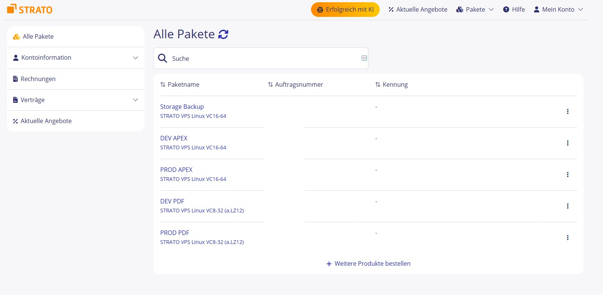
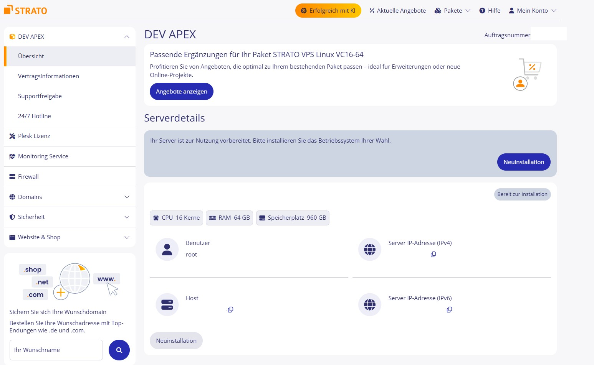
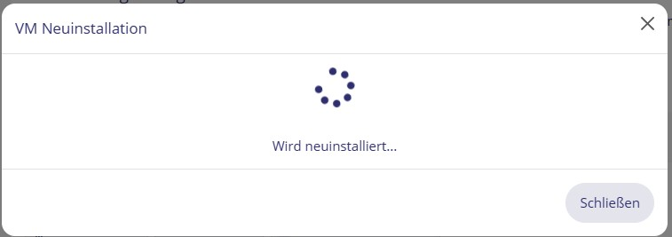
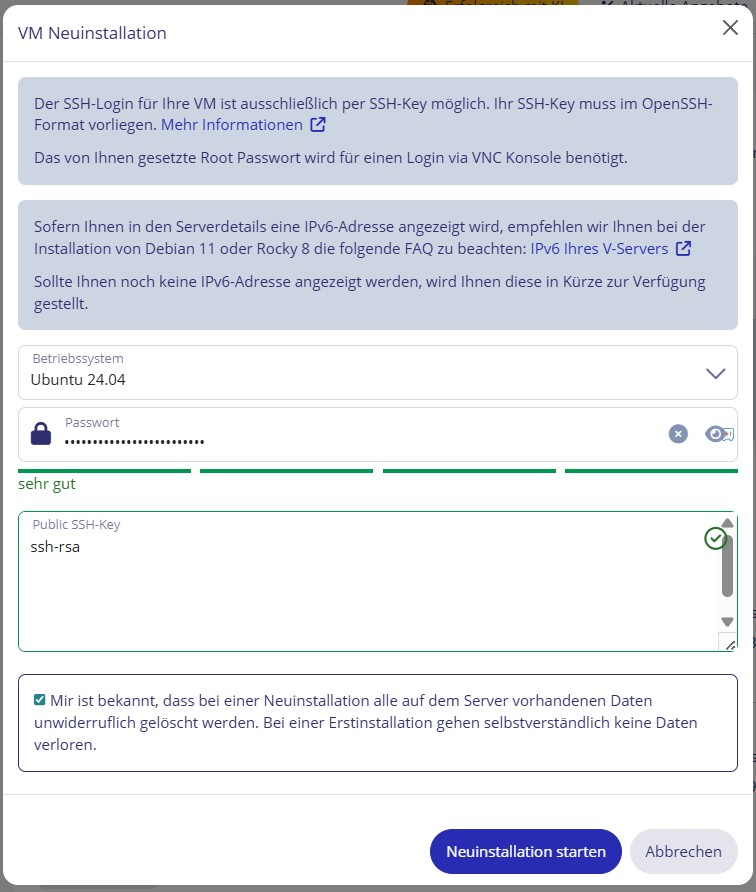
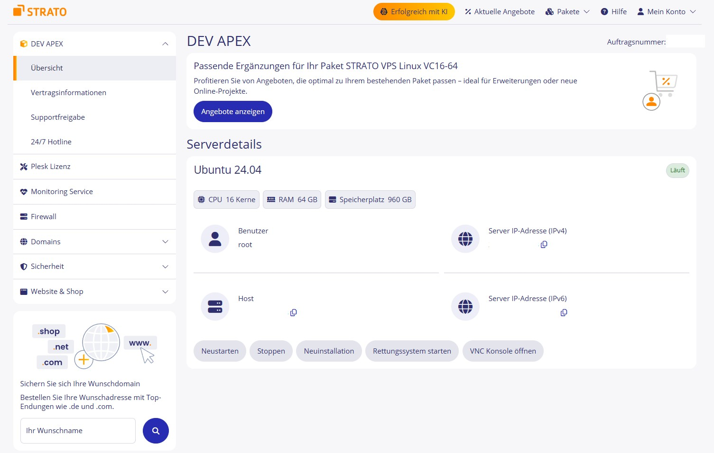
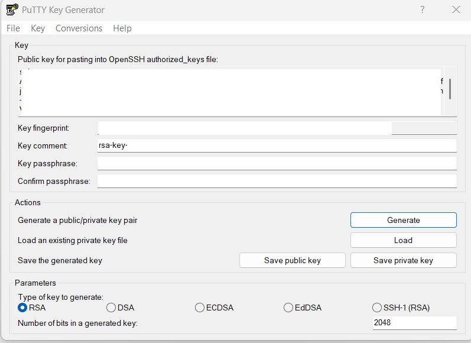
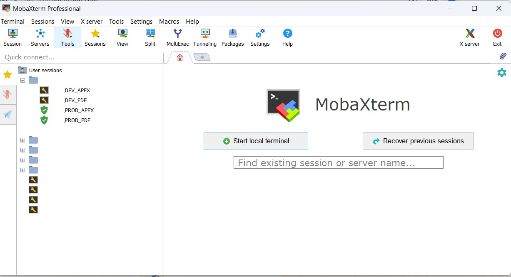
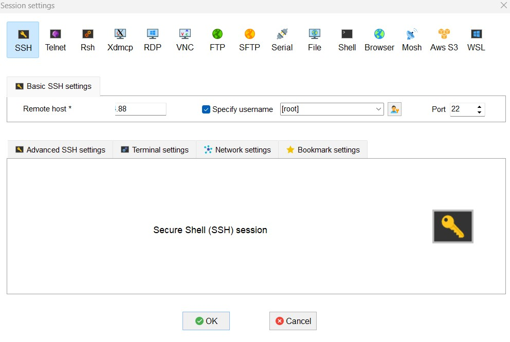
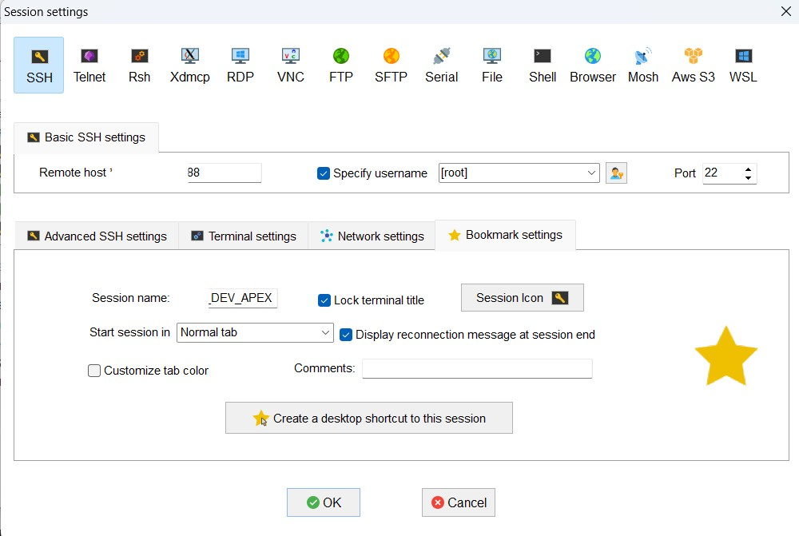

# Server Preparation

## Overview

In this workshop, we set up a complete Oracle APEX environment from scratch on two dedicated Linux servers. Before we can install any software, we need to prepare the servers — this means ordering them from a hosting provider, installing the operating system, setting up secure SSH access, and connecting to them for the first time.

This guide covers every step in detail so that you can repeat the entire process on your own at any time.

---

## What We Are Building

In our lab we use two separate servers, each with a dedicated role:

- **Database Server** — this server runs Oracle Database, ORDS (Oracle REST Data Services), and Nginx as a reverse proxy. This is the core of the APEX environment.
- **PDF Server** — this server handles everything around document generation and automation. It runs Apache, Python, n8n, and an FTP service, also behind Nginx.

Separating the two servers keeps the environment clean and makes it easier to scale or troubleshoot individual components later.

---

## Hosting Provider – Strato

In this workshop we use **Strato** as our hosting provider. Strato is a German hosting company that offers dedicated and virtual servers with a straightforward control panel. You can book servers by the month, reinstall the OS at any time, and manage SSH keys directly from the web interface — which makes it a good fit for a lab environment like ours.

If you use a different hosting provider (e.g. Hetzner, Netcup, DigitalOcean), the steps will be very similar — the Strato screenshots will look different but the concept is the same.

---

## 1. Strato – Server Overview

After logging in to Strato, navigate to **Server & Cloud**. You will see a list of all your booked servers with their current status, IP addresses, and hardware configuration.



Write down the **public IP address** of each server. You will need these IP addresses in almost every step that follows — for SSH connections, for Nginx configuration, and for accessing the web interfaces.

---

## 2. Strato – Reinstall the Operating System

In our lab we always start with a fresh OS installation. This ensures there are no leftover packages or configurations from a previous setup that could cause unexpected problems.

Click on a server to open its detail page. Here you can see the current hardware specs, the assigned IP address, and the operating system.



Click on **Reinstall** to start the OS reinstall process. Select **Ubuntu 22.04 LTS** as the operating system. Ubuntu 22.04 is a long-term support release, which means it receives security updates until 2027 — a solid choice for a production-like lab environment.



In the installation form you will need to fill in a few details:

- **Hostname** — give the server a clear name, for example `db-server` for the database server and `pdf-server` for the PDF server. This name will appear in the terminal prompt and helps you keep track of which server you are working on.
- **Root password** — set a strong password. Even though we will use SSH keys for authentication, a root password is still needed as a fallback.
- **SSH public key** — paste in your SSH public key here. We will generate this in the next step. If you do not have a key yet, come back to this field after step 3.



The reinstall takes about 2–5 minutes. Once it is complete, the server status turns green and shows **Ready**. The server has now a clean Ubuntu 22.04 installation and is waiting for a connection.



Repeat this process for both servers before continuing.

---

## 3. Generate an SSH Key with PuTTY

SSH keys are the standard way to securely authenticate to a Linux server. Instead of typing a password every time you connect, your computer uses a cryptographic key pair — a **private key** that stays on your machine, and a **public key** that lives on the server. Only someone who has the matching private key can log in.

We generate the SSH key pair using **PuTTYgen**, which is included in the PuTTY installation package for Windows.

Open PuTTYgen, set the key type to **RSA** and the number of bits to **4096**. Click **Generate** and move your mouse randomly over the blank area — PuTTYgen uses your mouse movements as a source of randomness to generate the key.



Once the key is generated:

1. Copy the text in the **Public key** box at the top — this is what you paste into the Strato install form in step 2.
2. Click **Save private key** and store the `.ppk` file in a safe location on your computer. Give it a clear name, for example `strato-lab.ppk`.

> **Important:** The private key file is your password. Never share it with anyone. If you lose it, you will need to generate a new key pair and update the public key on all servers.

---

## 4. Connect to the Servers with MobaXterm

**MobaXterm** is a terminal application for Windows that combines SSH, file transfer (SFTP), and many other tools in one interface. In our lab we use it to connect to both servers and manage files directly on the server.

Open MobaXterm and you will see the session manager on the left side with all your saved connections.



To add a new server, click **New Session** and select **SSH**. Fill in the following fields:

- **Remote host** — the public IP address of the server from step 1
- **Username** — `root`
- **Port** — `22` (default SSH port)
- Enable **Use private key** and browse to the `.ppk` file you saved in step 3



Give the session a descriptive name so you can identify it quickly, for example `Lab – DB Server` or `Lab – PDF Server`. MobaXterm saves this as a bookmark in the left sidebar and you can connect with a single click from now on.



Click **OK** and connect. If everything is configured correctly, you will see the Ubuntu terminal prompt. You are now connected to the server and ready to start the setup.

---

## 5. First Login – Basic Server Setup

After connecting to a server for the first time, we run a short set of commands to bring the system up to date. Run these commands on **both servers** before continuing.

```bash
# Update the package list and upgrade all installed packages to the latest version
apt update && apt upgrade -y

# Set the correct timezone
timedatectl set-timezone Europe/Berlin
```

After running these commands, both servers are up to date and ready for the next steps.
