# Portainer

## What is Portainer?

Portainer is a lightweight web-based UI for Docker. Instead of managing everything through the command line, Portainer gives you a clean visual dashboard where you can deploy containers, view logs, manage volumes and networks — all from the browser.

In our lab, **Portainer is the first thing we install on every server.** Everything else — the Oracle Database, ORDS, Nginx — gets deployed and managed through it.

---

## Requirements

| Item | Details |
|------|---------|
| OS | Ubuntu 22.04 LTS |
| User | `root` |
| Open Ports | `9000` (Web UI), `8000` (Agent) |
| Depends on | Docker |

---

## Step 1 — Connect to the Server

Open MobaXterm and connect to the database server via SSH. Once connected, you will see the Ubuntu welcome screen with basic system information like CPU load, memory usage, and the server's IP address.

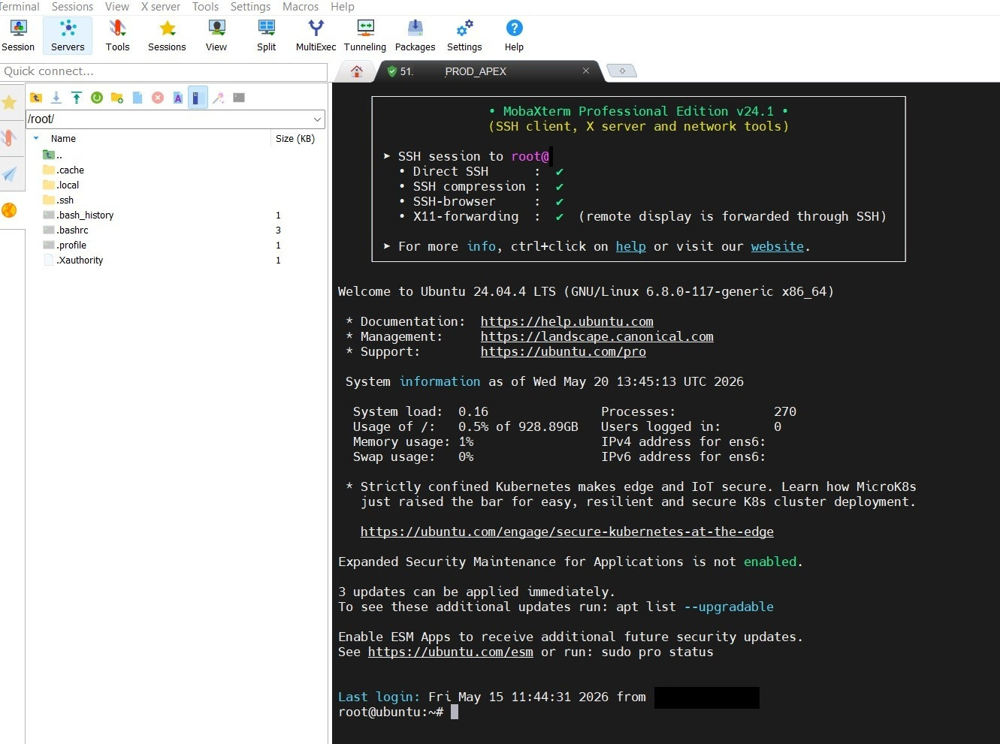

---

## Step 2 — Install Docker

Before we can run Portainer, Docker needs to be installed on the server.

**Add the Docker GPG key** — this allows the system to verify the authenticity of Docker packages:

```bash
curl -fsSL https://download.docker.com/linux/ubuntu/gpg | sudo gpg --dearmor -o /usr/share/keyrings/docker-archive-keyring.gpg
```

> If the file already exists, you will be asked `Overwrite? (y/N)` — type `y` and press Enter.

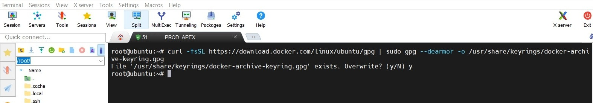

**Add the official Docker repository** to the package sources:

```bash
echo "deb [arch=amd64 signed-by=/usr/share/keyrings/docker-archive-keyring.gpg] https://download.docker.com/linux/ubuntu $(lsb_release -cs) stable" | sudo tee /etc/apt/sources.list.d/docker.list > /dev/null
```

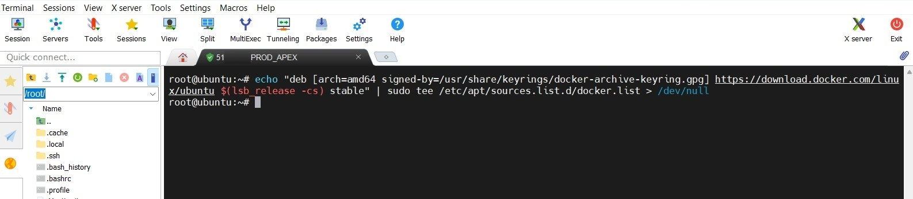

**Update the package list and install Docker:**

```bash
sudo apt update
sudo apt install docker-ce docker-ce-cli containerd.io -y
```

> If Docker is already installed, apt will confirm it with `already the newest version` and do nothing. This is fine — just continue.

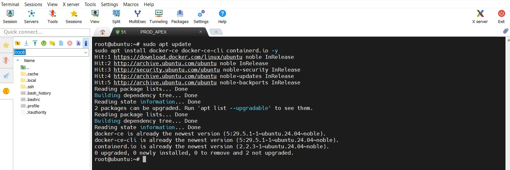

**Start Docker and enable it on boot** — this ensures Docker starts automatically every time the server reboots:

```bash
sudo systemctl start docker
sudo systemctl enable docker
```

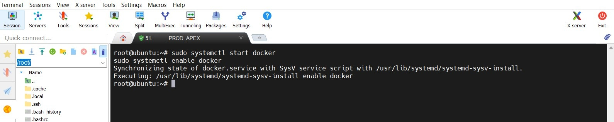

**Verify the installation:**

```bash
docker --version
```

You should see something like `Docker version 29.5.1` — this confirms Docker is running correctly.

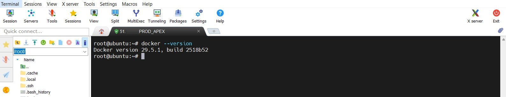

---

## Step 3 — Create Network and Volume

Before starting Portainer, we create a dedicated Docker network and a persistent volume.

- The **network** keeps Portainer and its managed containers organized and isolated from each other
- The **volume** ensures all Portainer data — users, settings, stacks — survives container restarts and updates

```bash
docker network create portainer
docker volume create portainer_data
```

After running these commands, Docker will output a long hash ID confirming the volume was created successfully.

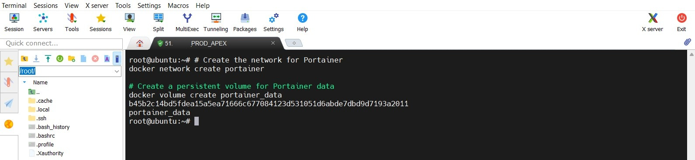

---

## Step 4 — Install Portainer

Run the following command to pull the Portainer image and start the container:

```bash
docker run -d \
  --name=portainer \
  --network=portainer \
  --restart=always \
  -p 8000:8000 \
  -p 9000:9000 \
  -v /var/run/docker.sock:/var/run/docker.sock \
  -v portainer_data:/data \
  portainer/portainer-ce
```

Docker will pull the Portainer image from Docker Hub and start the container. When done, it outputs the full container ID — this means Portainer is running.

**What each option does:**

| Option | Description |
|--------|-------------|
| `--name=portainer` | Gives the container a fixed, referenceable name |
| `--network=portainer` | Connects it to our dedicated Docker network |
| `--restart=always` | Auto-restarts on server reboot or container crash |
| `-p 9000:9000` | Web UI — open this in the browser |
| `-p 8000:8000` | Docker agent port for edge connections |
| `-v /var/run/docker.sock` | Grants Portainer access to the Docker engine |
| `-v portainer_data:/data` | Mounts the persistent volume for saved data |

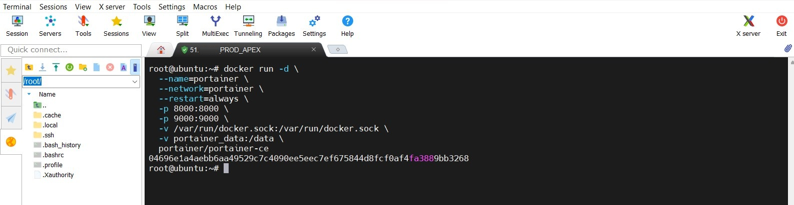

---

## Step 5 — First Setup in the Browser

Open your browser and navigate to:

```
http://<YOUR-SERVER-IP>:9000
```

On the first visit, Portainer asks you to create an initial admin account. Enter a username (default is `admin`) and a strong password — **minimum 12 characters**. Click **Create user** to continue.

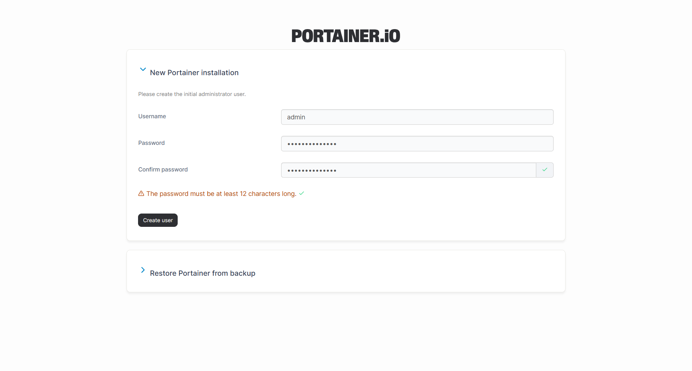

After creating the account, Portainer shows the **Environment Wizard**. Click **Get Started** to use the local Docker environment that Portainer is already running in.

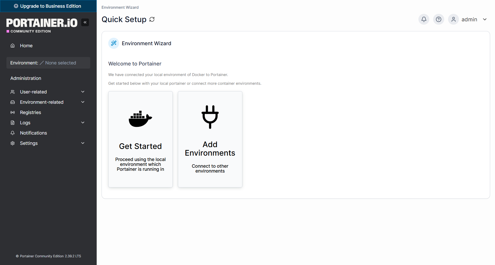

You are now on the Portainer **Home** dashboard. You can see the local environment with a summary of running containers, volumes, networks, and available CPU and memory.

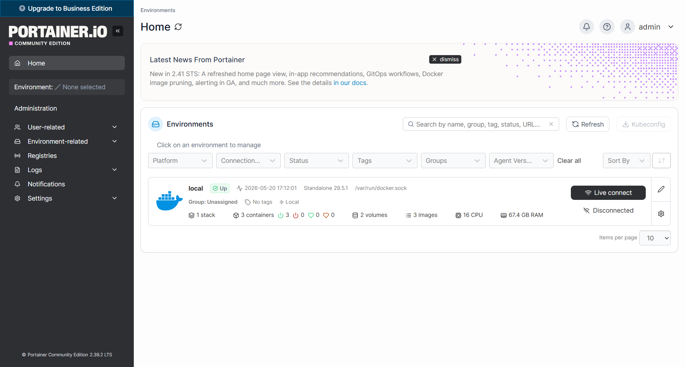

---

## Step 6 — Set the Public IP

This is an important step that many people skip. By default, Portainer uses the internal Docker network IP to link to container ports. If you click on a published port in the container list, it will try to open an internal IP that your browser cannot reach.

To fix this, go to **Settings → Environments → local → Edit** and enter the public IP address of your server in the **Public IP** field. Click **Update environment** to save.

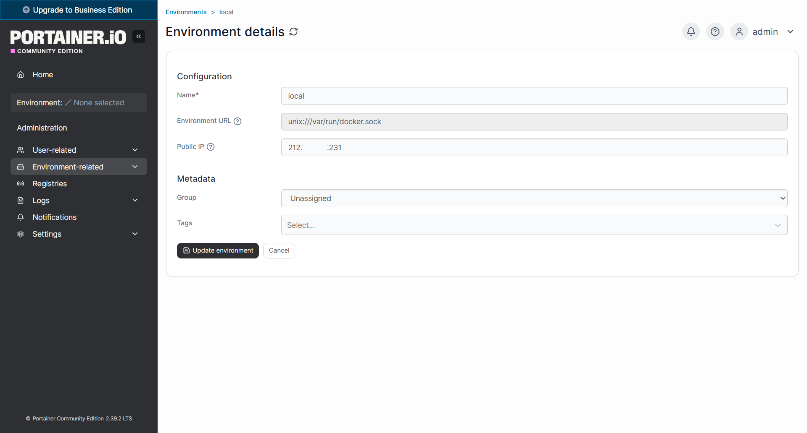

After saving, you can click directly on any published port number in the container list and Portainer will open the correct public URL in the browser — no more manually typing IP addresses.

---

## Step 7 — Verify the Installation

Go to **local → Containers** in the left sidebar. You should see the `portainer` container with status **running**, published ports `8000` and `9000`, and the image `portainer/portainer-ce`.

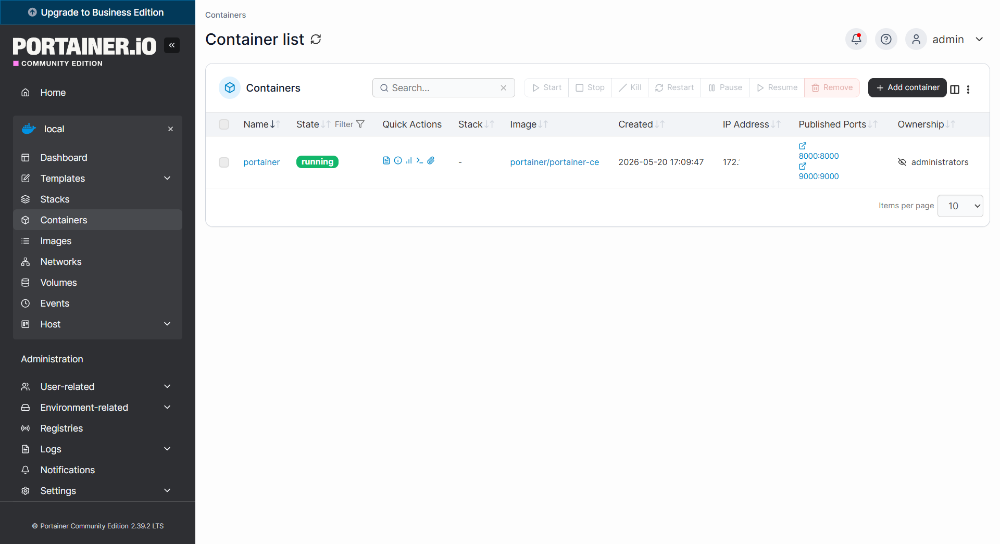

Portainer is now fully installed and configured. The next step is to deploy Nginx through Portainer.

---

## Remove Portainer

If you need to completely remove Portainer and start fresh, run the following:

```bash
# Stop and remove the container
docker stop portainer
docker rm portainer

# Remove the Docker network
docker network rm portainer

# Remove the volume — only if you want to delete all data
docker volume rm portainer_data
```

> **Note:** If you only want to reinstall Portainer without losing your configuration, skip the last command. The volume will be reused automatically when you run the install command again.
