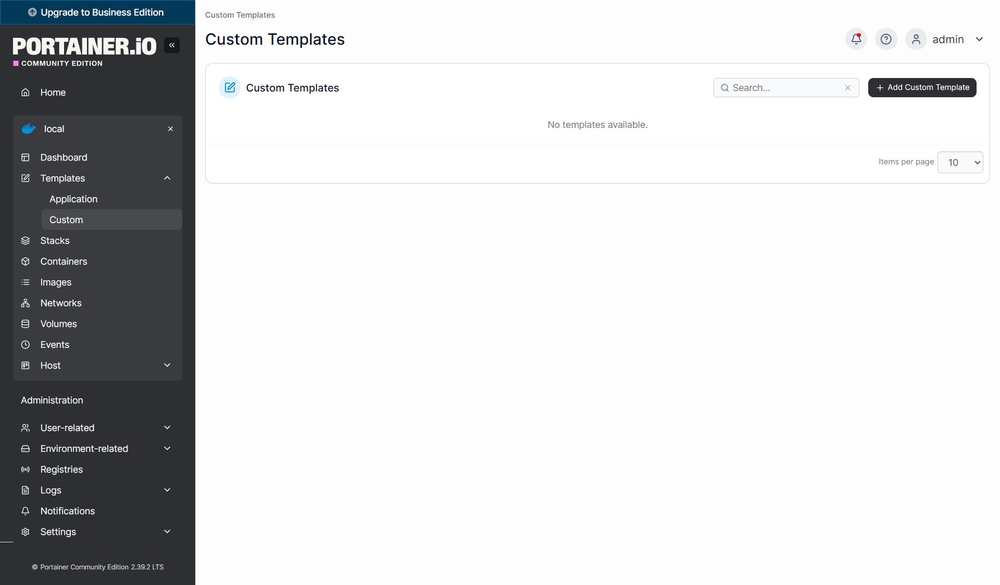
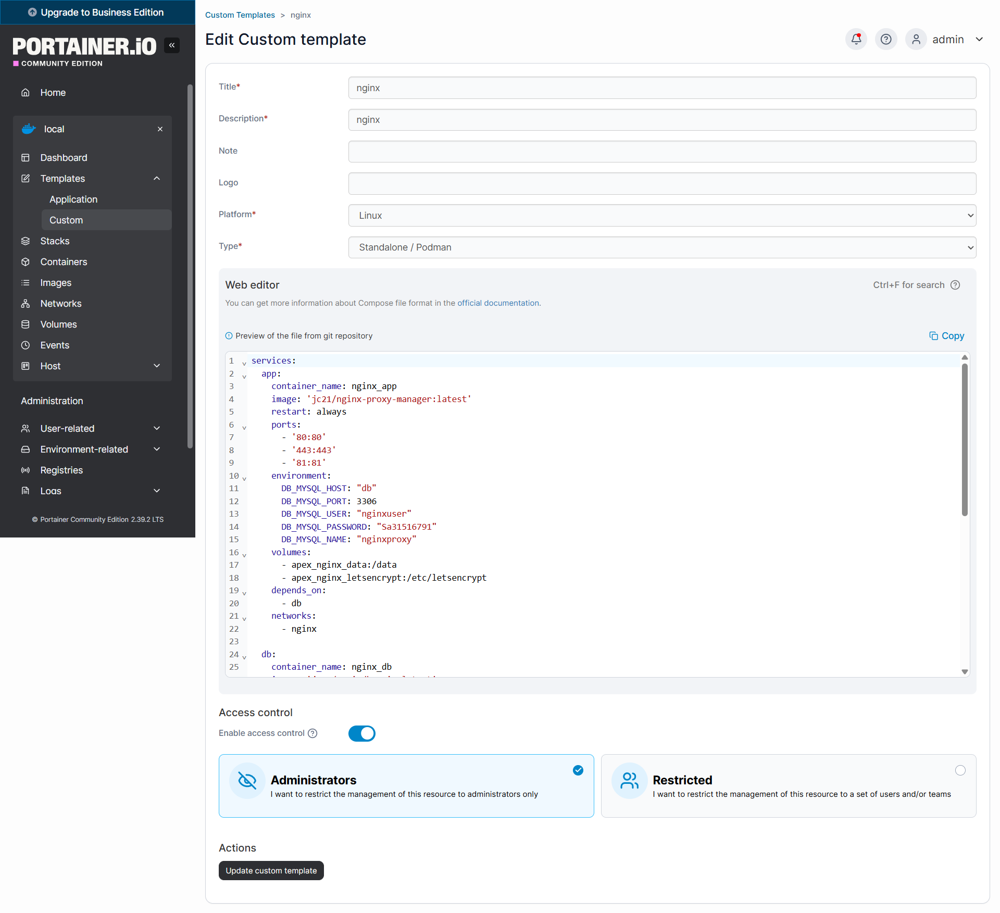
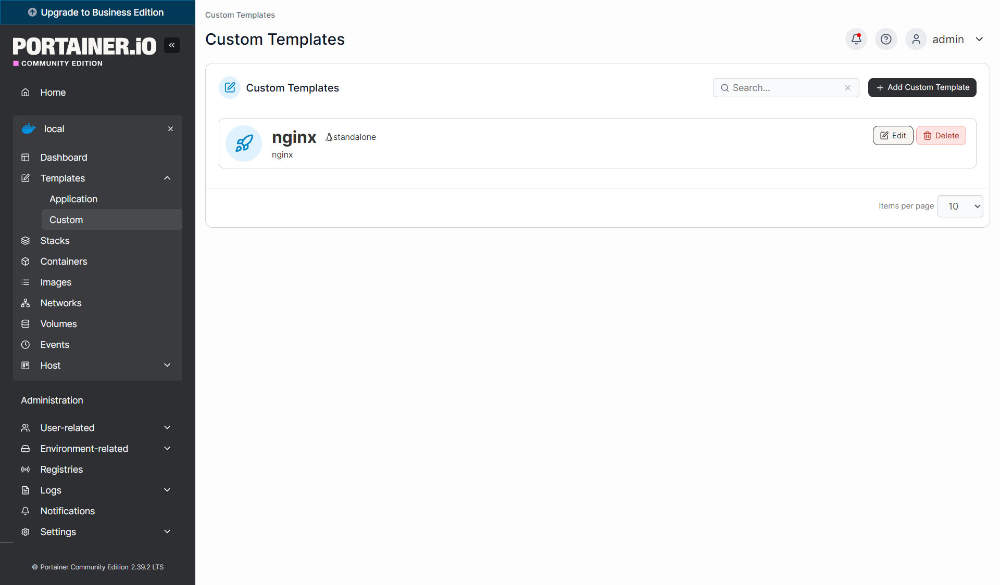
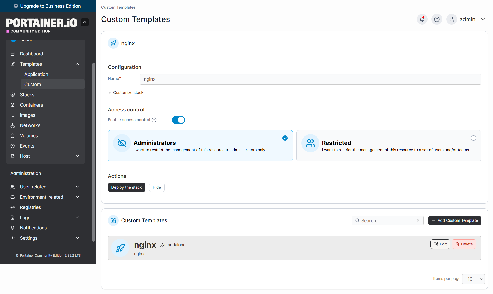
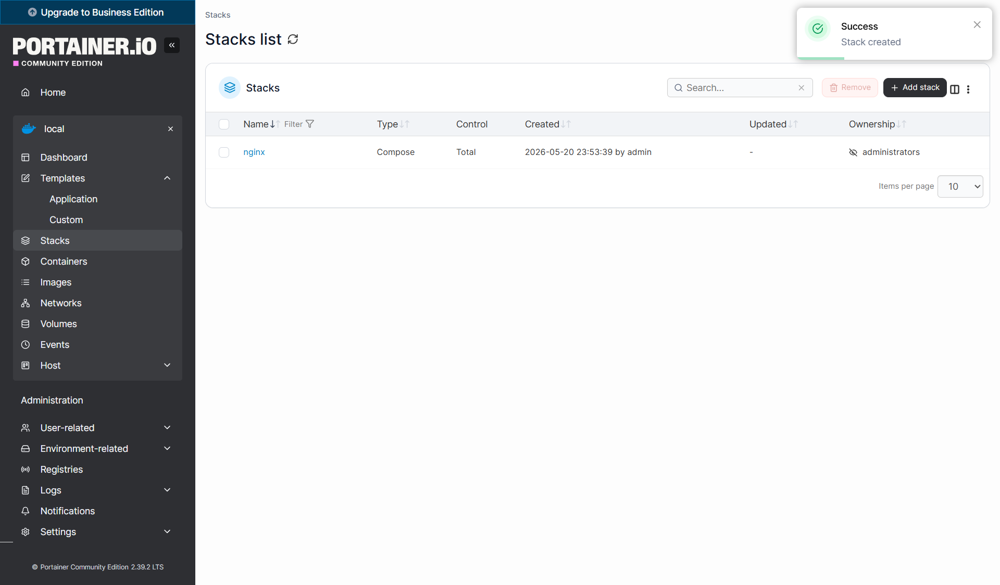
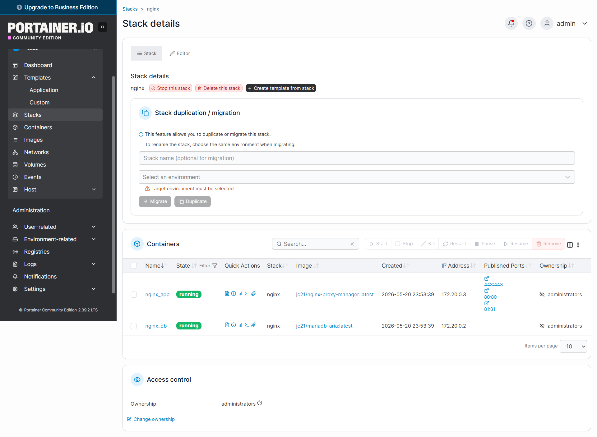
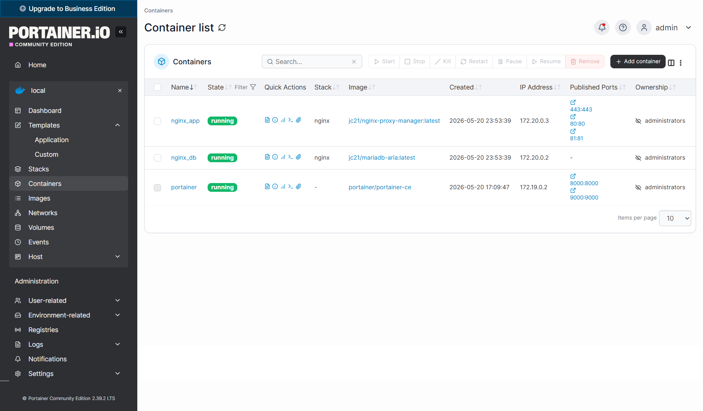
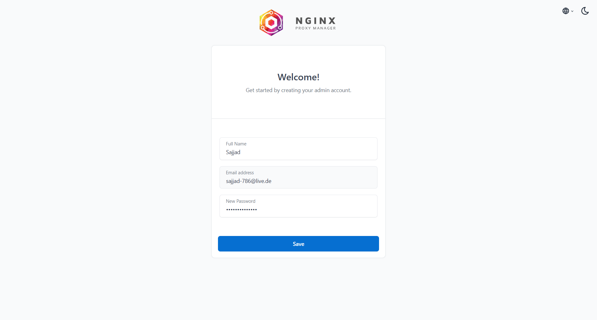
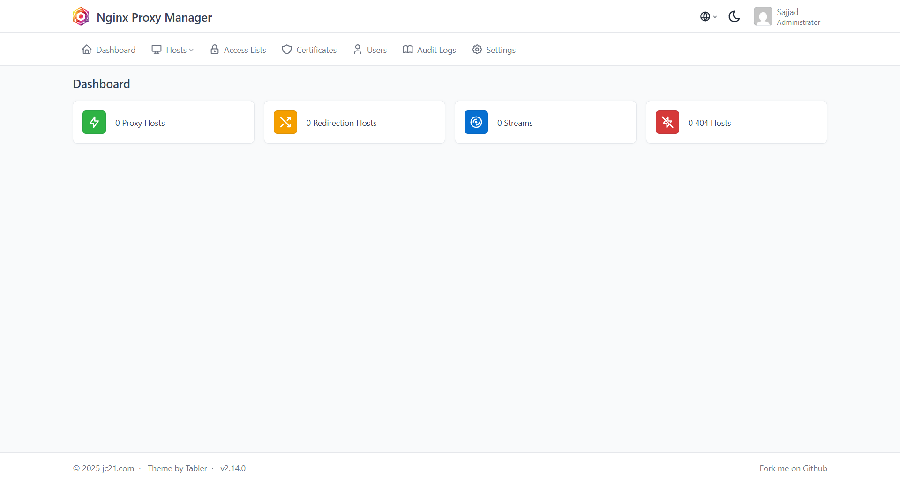
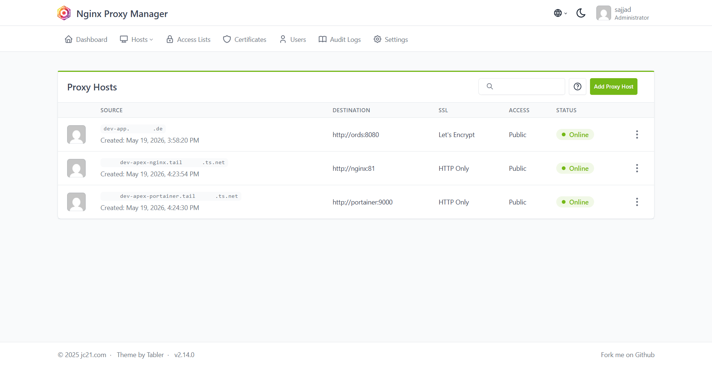

# Nginx Proxy Manager

## What is Nginx Proxy Manager?

Nginx Proxy Manager is a web-based reverse proxy built on top of Nginx. It allows you to route incoming traffic to different containers and services, manage SSL certificates automatically via Let's Encrypt, and configure domains — all through a clean browser interface without ever touching a config file manually.

In our lab, Nginx Proxy Manager sits in front of ORDS and handles all incoming HTTPS traffic. Every domain or subdomain we want to expose publicly gets a proxy host entry here — including the APEX application itself, as well as internal tools like Portainer.

---

## Requirements

| Item | Details |
|------|---------|
| OS | Ubuntu 22.04 LTS |
| User | `root` |
| Open Ports | `80` (HTTP), `443` (HTTPS), `81` (Admin UI) |
| Depends on | Docker, Portainer |

---

## Step 1 — Open Custom Templates in Portainer

We deploy Nginx Proxy Manager using a Custom Template in Portainer. Using a template instead of deploying a stack directly has one big advantage: the configuration is saved and reusable. If you ever need to redeploy Nginx — for example after a server reset — you can do it in two clicks without having to paste the YAML again.

Open Portainer at `http://<YOUR-SERVER-IP>:9000` and navigate to **local → Templates → Custom** in the left sidebar. At the start, the list is empty.



Click **Add Custom Template** in the top right corner.

---

## Step 2 — Create the Nginx Template

Fill in the template form:

- **Title** — `nginx`
- **Description** — `nginx` (or anything descriptive)
- **Platform** — `Linux`
- **Type** — `Standalone / Podman`

In the **Web editor** below, paste the following Docker Compose configuration:

```yaml
services:
  app:
    container_name: nginx_app
    image: 'jc21/nginx-proxy-manager:latest'
    restart: always
    ports:
      - '80:80'
      - '443:443'
      - '81:81'
    environment:
      DB_MYSQL_HOST: "db"
      DB_MYSQL_PORT: 3306
      DB_MYSQL_USER: "nginxuser"
      DB_MYSQL_PASSWORD: "your-strong-password"
      DB_MYSQL_NAME: "nginxproxy"
    volumes:
      - apex_nginx_data:/data
      - apex_nginx_letsencrypt:/etc/letsencrypt
    depends_on:
      - db
    networks:
      - nginx

  db:
    container_name: nginx_db
    image: 'jc21/mariadb-aria:latest'
    restart: always
    environment:
      MYSQL_ROOT_PASSWORD: 'your-root-password'
      MYSQL_DATABASE: 'nginxproxy'
      MYSQL_USER: 'nginxuser'
      MYSQL_PASSWORD: 'your-strong-password'
      MARIADB_AUTO_UPGRADE: '1'
    volumes:
      - apex_nginx_mysql:/var/lib/mysql
    networks:
      - nginx

volumes:
  apex_nginx_data:
    name: apex_nginx_data
  apex_nginx_letsencrypt:
    name: apex_nginx_letsencrypt
  apex_nginx_mysql:
    name: apex_nginx_mysql

networks:
  nginx:
    driver: bridge
    name: nginx
```

> Replace `your-strong-password` and `your-root-password` with real passwords before saving. Use the same password for `DB_MYSQL_PASSWORD` and `MYSQL_PASSWORD`.

Under **Access control**, leave it set to **Administrators**. Click **Create custom template** to save.



---

## Step 3 — Template Saved

The nginx template now appears in the Custom Templates list. It can be edited at any time by clicking **Edit**, or deleted if no longer needed.



---

## Step 4 — Deploy the Stack from the Template

Click on the **nginx** template to open the deployment view. You will see a configuration panel with the stack name pre-filled as `nginx`. Leave everything as is and click **Deploy the stack**.



Portainer will pull both Docker images — `jc21/nginx-proxy-manager` and `jc21/mariadb-aria` — and start both containers. This may take a minute on the first run since the images need to be downloaded.

---

## Step 5 — Stack Created Successfully

Once deployed, Portainer redirects you to the **Stacks list** and shows a green **Stack created** notification in the top right corner. The nginx stack appears in the list with type **Compose**.



---

## Step 6 — Stack Details

Click on the **nginx** stack to open its detail view. Here you can see both containers — `nginx_app` and `nginx_db` — with status **running**. You can also stop, restart, or redeploy the entire stack from this view.



---

## Step 7 — All Containers Running

Navigate to **local → Containers** to get a full overview. You should now see three containers all with status **running**:

- `nginx_app` — the Nginx Proxy Manager web interface and proxy engine
- `nginx_db` — the MariaDB database used by Nginx Proxy Manager to store its configuration
- `portainer` — the Portainer container itself, which was already running from the previous step



---

## Step 8 — First Login to Nginx Proxy Manager

Open your browser and navigate to the Nginx Proxy Manager admin interface:

```
http://<YOUR-SERVER-IP>:81
```

On the first visit you will see a **Welcome** screen asking you to create your admin account. Fill in:

- **Full Name** — your name
- **Email address** — your email (this is used to log in)
- **New Password** — choose a strong password

Click **Save** to create the account.



---

## Step 9 — Nginx Proxy Manager Dashboard

After logging in, you land on the **Dashboard**. It shows four counters — Proxy Hosts, Redirection Hosts, Streams, and 404 Hosts — all starting at zero. This is expected since we have not configured any proxy rules yet.

From here you manage all routing rules, SSL certificates, and access controls for every service running behind this proxy.



---

## Final Result — What it Looks Like in Use

> **Important — How Container Name Routing Works:**
> When configuring proxy hosts in Nginx Proxy Manager, you will notice that the destination uses container names like `http://ords:8080` or `http://portainer:9000` instead of IP addresses. This works because all containers — Nginx, ORDS, Portainer, and the database — are connected to the same Docker network. Within a Docker network, every container can reach any other container simply by using its container name as the hostname. Docker handles the DNS resolution internally.
>
> If you try to use an IP address like `http://172.19.0.3:8080` instead of the container name, it will likely break the next time the container restarts — because Docker assigns internal IPs dynamically and they can change. Always use the container name. If Nginx cannot resolve a container name, it usually means that container is not on the same Docker network as `nginx_app`.

The screenshot below shows what Nginx Proxy Manager looks like once fully configured with all proxy hosts in place. In our setup, three entries are active:

- **APEX domain** → routes to `http://ords:8080` with a **Let's Encrypt SSL certificate** — this is the public-facing Oracle APEX URL
- **Nginx subdomain** (via Tailscale) → routes to `http://nginx:81` — gives access to the Nginx Proxy Manager admin UI via a private VPN subdomain
- **Portainer subdomain** (via Tailscale) → routes to `http://portainer:9000` — gives access to Portainer via a private VPN subdomain

The Tailscale subdomains and how to set them up are covered in a separate guide. For now, Nginx Proxy Manager is installed and ready to accept your first proxy host.



---

## Tailscale Conflict Fix

> **This section only applies if you are running Tailscale on the same server. Screenshots for this section will be added in a future update.**

### Why the Conflict Happens

Tailscale and Docker both manage network routing rules via `iptables`. When Tailscale is running and you deploy or redeploy the Nginx stack, Tailscale's rules can block Docker from correctly routing traffic to the Nginx containers. The result is that ports 80, 443, and 81 become unreachable even though the containers are running fine.

### Before Deploying — Stop Tailscale First

Every time you deploy or redeploy the Nginx stack, stop Tailscale first:

```bash
systemctl stop tailscaled
```

### Check the Current iptables Rules

After stopping Tailscale, check what rules are currently in the Docker chain:

```bash
iptables -L DOCKER-USER -n --line-numbers
```

### Flush the DOCKER-USER Chain

Remove all conflicting rules at once:

```bash
iptables -F DOCKER-USER
```

This gives Docker a clean slate. After this, redeploy or restart the Nginx containers and everything will come up correctly.

### Permanent Fix — Autostart Script

The same conflict also happens on every server reboot. To fix it permanently, create an autostart script:

```bash
mkdir -p /home/autostart

cat > /home/autostart/nginx-tailscale-fix.sh << 'EOF'
#!/bin/bash
sleep 15

# Stop Tailscale to avoid iptables conflicts
systemctl stop tailscaled

# Start the database container first
docker restart nginx_db
sleep 5

# Start the Nginx app container
docker restart nginx_app
sleep 5

# Make sure both containers are on the correct network
docker network connect nginx nginx_db 2>/dev/null || true
docker network connect nginx nginx_app 2>/dev/null || true

# Restart Nginx app to pick up the correct network config
sleep 5
docker restart nginx_app

# Bring Tailscale back up
systemctl start tailscaled
systemctl enable tailscaled
EOF

chmod +x /home/autostart/nginx-tailscale-fix.sh
```

Register it as a systemd service so it runs automatically on every boot after Docker is ready:

```bash
cat > /etc/systemd/system/nginx-tailscale-fix.service << 'EOF'
[Unit]
Description=Nginx Tailscale Fix
After=docker.service tailscaled.service
Requires=docker.service

[Service]
Type=oneshot
ExecStart=/bin/bash /home/autostart/nginx-tailscale-fix.sh
RemainAfterExit=yes

[Install]
WantedBy=multi-user.target
EOF

systemctl daemon-reload
systemctl enable nginx-tailscale-fix.service
```

Test it manually before rebooting:

```bash
bash /home/autostart/nginx-tailscale-fix.sh
```
