# Oracle Database 23c

## What is Oracle Database 23c?

Oracle Database 23c (also called Oracle Database 23ai) is the latest long-term support release of Oracle's flagship relational database. It is the database engine that powers Oracle APEX — every workspace, application, and piece of data lives inside an Oracle Database.

In our setup we run Oracle Database 23c Enterprise Edition as a Docker container. This approach has a clear advantage over a traditional bare-metal installation: the database runs in an isolated environment, it is easy to redeploy after a server reset, and it integrates naturally with the rest of our containerized stack (Portainer, Nginx, ORDS). The container image is not pulled from Docker Hub — instead we build it ourselves from Oracle's official open-source Dockerfile repository on GitHub, using the Oracle Database installer we host on our own Nextcloud. This gives us full control over the exact version and edition.

The overall process has two phases: first we build the Docker image on the server (Steps 1–9), then we deploy the container via Portainer as a Custom Template — the same pattern we already used for Nginx (Steps 10–18).

---

## Requirements

| Item | Details |
|------|---------|
| OS | Ubuntu 22.04 LTS |
| User | `root` |
| RAM | minimum 2 GB, recommended 4 GB+ |
| Disk | minimum 20 GB free |
| Open Ports | `1521` (Oracle Listener) |
| Depends on | Docker, Portainer |

---

## Step 1 — Create the Working Directory

Before we download anything, we create a dedicated folder for the Oracle Database setup. All files related to the build — the cloned repository and the downloaded Oracle installer — will live here. Keeping them together in one place makes it easy to find, clean up, or redo the process later.

```bash
cd /home/ && mkdir db23c && cd db23c
```

This creates `/home/db23c` and immediately changes into it. On the left side of MobaXterm you can already see the new `db23c` folder appearing under `/home/`.

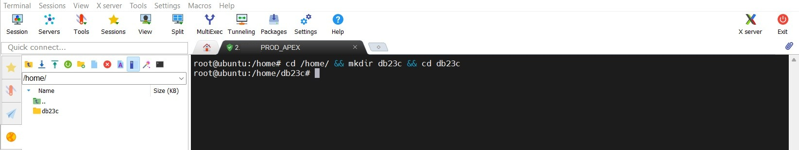

---

## Step 2 — Install Git

The Oracle build scripts are hosted on GitHub, so we need Git to clone the repository. We also run `apt update` first to make sure the package list is current before installing anything.

```bash
sudo apt update
sudo apt install git
```

In our case the output shows `git is already the newest version (1:2.43.0-1ubuntu7.3)` — Git was already present from a previous setup step and nothing was changed. If you are starting with a completely fresh server, Git will be installed now.

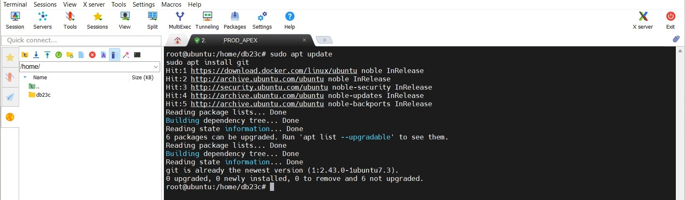

---

## Step 3 — Clone the Oracle Docker Images Repository

Oracle maintains an official open-source GitHub repository called `docker-images`. It contains Dockerfiles and build scripts for dozens of Oracle products, including Oracle Database. We clone the entire repository so we have access to the build scripts for version 23.26.1.

```bash
git clone https://github.com/oracle/docker-images.git
```

Git downloaded 20,059 objects — the entire repository including all historical versions — at 35.96 MiB/s and resolved all deltas. The repository is now available as a `docker-images/` subfolder inside `/home/db23c/`. The actual Oracle Database installer is not part of this repository; that is what we download in the next step.

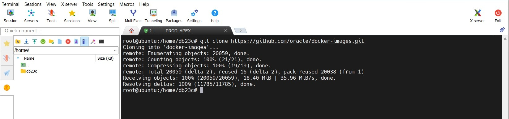

---

## Step 4 — Navigate to the 23c Dockerfile Directory

Inside the cloned repository, Oracle organizes the build files for each database version into its own subfolder. We navigate into the folder for version `23.26.1`, because the Oracle installer zip we are about to download must be placed here — alongside the Dockerfile — before the build can start.

```bash
cd /home/db23c/docker-images/OracleDatabase/SingleInstance/dockerfiles/23.26.1/
```

The MobaXterm file browser on the left confirms we are in the right place. You can see all the supporting scripts Oracle provides for this version — `Containerfile`, `Containerfile.free`, `createDB.sh`, `runOracle.sh`, `setPassword.sh`, and others. These scripts are called automatically during the image build and handle everything from installing the Oracle binaries to creating the initial database.

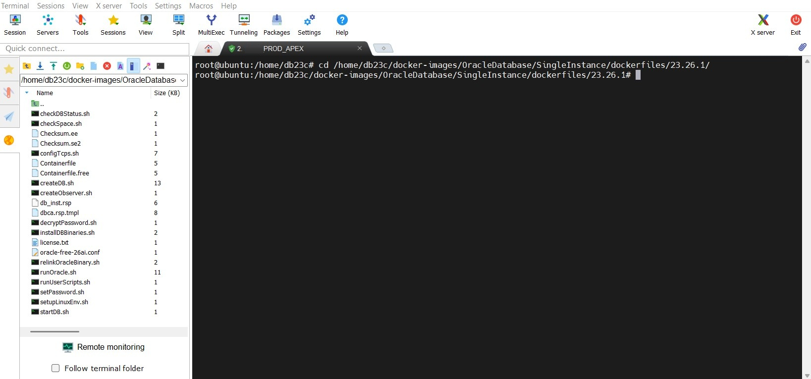

---

## Step 5 — Download the Oracle Database Installer

The Oracle Database installer (`LINUX.X64_2326100_db_home.zip`) is the core input for the image build. It contains the Oracle binaries that get installed inside the container. This file must be placed in the `23.26.1/` directory — the build script looks for it there by name.

We download it directly from our private Nextcloud using `curl`. The `-O` flag saves the file using its original filename.

```bash
curl -O https://nextcloud.shsoftwaresolution.com/index.php/s/qooocWeYtoXf3Gj/download/LINUX.X64_2326100_db_home.zip
```

The download completed at an average speed of 4,677 kB/s and took 8 minutes and 22 seconds for a total of 2,294 MB (approximately 2.3 GB). In the MobaXterm file browser you can see `LINUX.X64_2326100_db_home.zip` now listed in the directory — highlighted in blue, with a size of 2,349,666 KB. Everything is in place for the build.

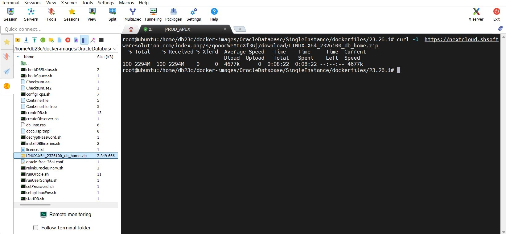

---

## Step 6 — Navigate to the Build Script Directory

The `buildContainerImage.sh` script is located one level up from the version folder — in the `dockerfiles/` directory. This is by design: the script is shared across all Oracle Database versions and accepts the version number as a parameter. We navigate there now before running it.

```bash
cd /home/db23c/docker-images/OracleDatabase/SingleInstance/dockerfiles
```

In the MobaXterm file browser you can now see all supported Oracle Database version folders side by side: 11.2.0.2, 12.1.0.2, 12.2.0.1, 18.3.0, 18.4.0, 19.3.0, 21.3.0, and 23.26.1 — alongside the `buildContainerImage.sh` script itself. This script is what we will call in the next step.

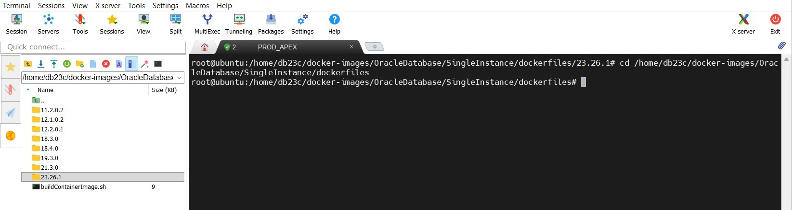

---

## Step 7 — Start Building the Docker Image

With the installer in place and the build script ready, we start the image build. We pass two flags: `-v` for the version and `-e` to build the Enterprise Edition.

```bash
./buildContainerImage.sh -v 23.26.1 -e
```

The script first prints system information — architecture, number of CPUs, total memory — and then starts the Docker build process. You can see it begin: `Building image 'oracle/database:23.26.1-ee'` followed by the first build steps loading the Containerfile and pulling the base Oracle Linux image from Docker Hub.

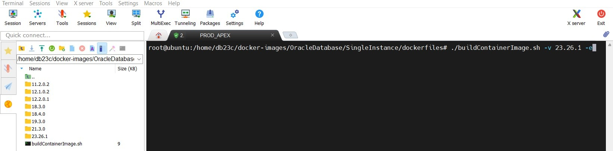

---

## Step 8 — Build in Progress

The build takes time. Docker works through the layers defined in the Containerfile: it pulls the Oracle Linux 9 base image, copies the installer zip (1.21 GB) into the build context, extracts it, and runs the full Oracle Database installation inside a temporary container. You can follow each step as it completes with its timing on the right.

This process is **expected to take 10–20 minutes** — do not interrupt it. As long as new lines keep appearing, the build is still running normally.

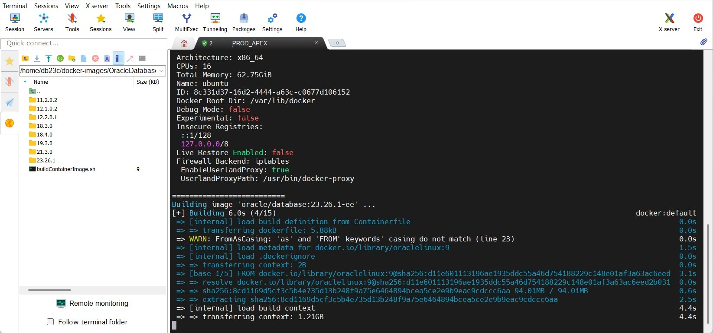

---

## Step 9 — Build Complete

When the build finishes successfully, the terminal prints the confirmation:

```
Oracle Database container image for 'ee' version 23.26.1 is ready to be extended:
    --> oracle/database:23.26.1-ee

Build completed in 540 seconds.
```

In our case the entire build took **540 seconds** (9 minutes). The image `oracle/database:23.26.1-ee` is now stored locally on the server. It is not uploaded to any registry — it lives only on this machine, which is exactly what we want, since the Enterprise Edition is not meant to be distributed publicly.

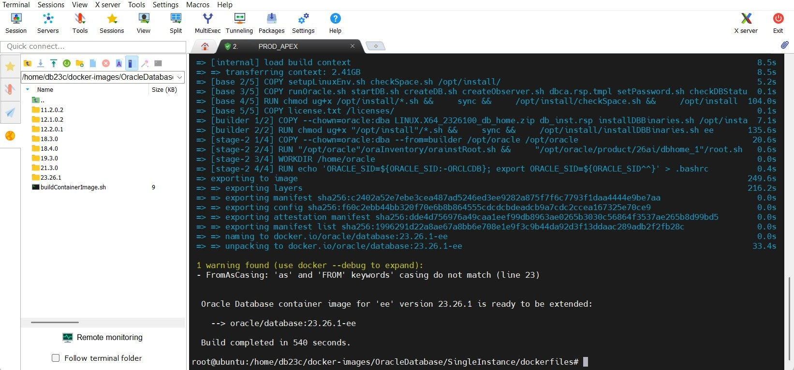

---

## Step 10 — Verify the Image in Portainer

Open Portainer at `http://<YOUR-SERVER-IP>:9000` and navigate to **local → Images** in the left sidebar. You can now see the freshly built `oracle/database` image with tag `23.26.1-ee` listed — size **10.9 GB**. This confirms that Docker has the image available and Portainer can use it to deploy a container.

Notice that the image was created at `2026-05-25 15:14:56` — matching exactly when our build finished. The other images in the list are ones already present from previous steps (Nginx, Portainer itself).

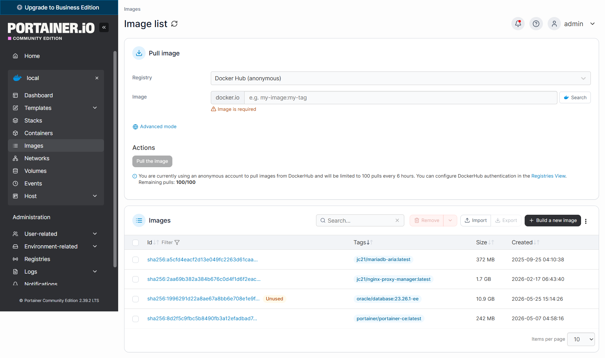

---

## Step 11 — Create a Custom Template in Portainer

Just like we did for Nginx, we deploy Oracle Database using a Custom Template in Portainer. This saves the full Compose configuration so that it can be redeployed at any time in two clicks — without having to remember or retype the YAML.

Navigate to **local → Templates → Custom** and click **Add Custom Template**. Fill in:

- **Title** — `database`
- **Description** — `database`
- **Platform** — `Linux`
- **Type** — `Standalone / Podman`

In the **Web editor**, paste the following Docker Compose configuration:

```yaml
version: '3.9'
services:
  database:
    image: oracle/database:23.26.1-ee
    container_name: database
    hostname: database
    restart: always
    ports:
      - "1521:1521"
    environment:
      ORACLE_PWD: "your-strong-password"
      ORACLE_CHARACTERSET: "AL32UTF8"
      ORACLE_SID: "ORCL"
      ORACLE_PDB: "ORCLPDB"
    volumes:
      - oracle-23c-data:/opt/oracle/oradata
    networks:
      - database-ords

networks:
  database-ords:
    name: database-ords

volumes:
  oracle-23c-data:
    name: oracle-23c-data
```

A few things worth noting about this configuration:

- `container_name: database` and `hostname: database` are both set explicitly. The hostname is important because ORDS will later connect to the database using this name as the host within the shared Docker network.
- The Docker network is named `database-ords`. ORDS will be attached to this same network, which is how the two containers will communicate without exposing the database port publicly beyond port 1521.
- Both the network and the volume have explicit `name:` fields. Without these, Portainer would prefix the names with the stack name (e.g. `database_oracle-23c-data`), which makes them harder to reference later.

> Replace `your-strong-password` with a strong password. Write it down — you will need it for ORDS configuration and for SQL Developer access.

Under **Access control**, leave it set to **Administrators**. Click **Update custom template** to save.

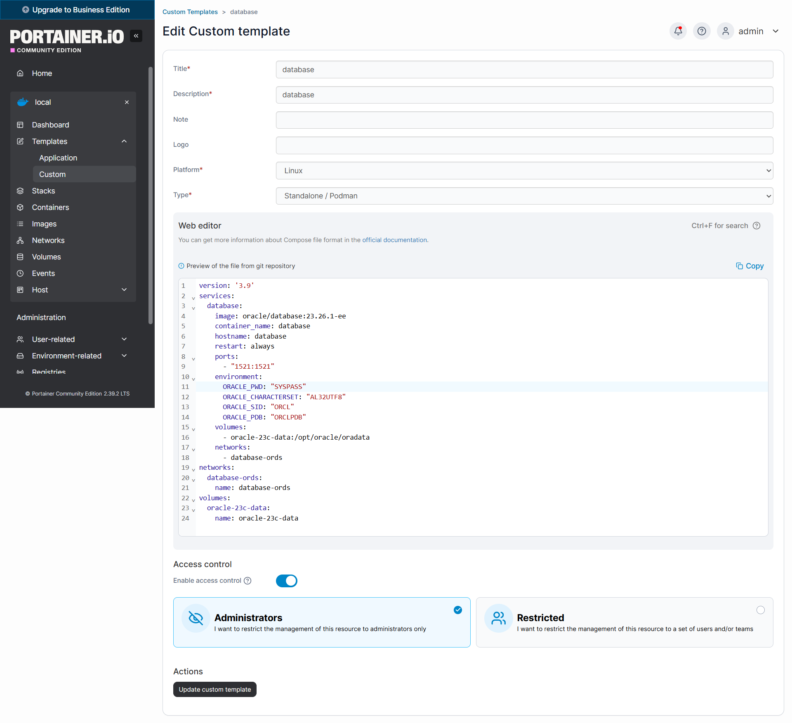

---

## Step 12 — Template Saved

The `database` template now appears in the Custom Templates list alongside the `nginx` template from the previous chapter. Both are marked as standalone templates and can be deployed independently at any time. The fact that both templates are visible here confirms that the database template was saved correctly.

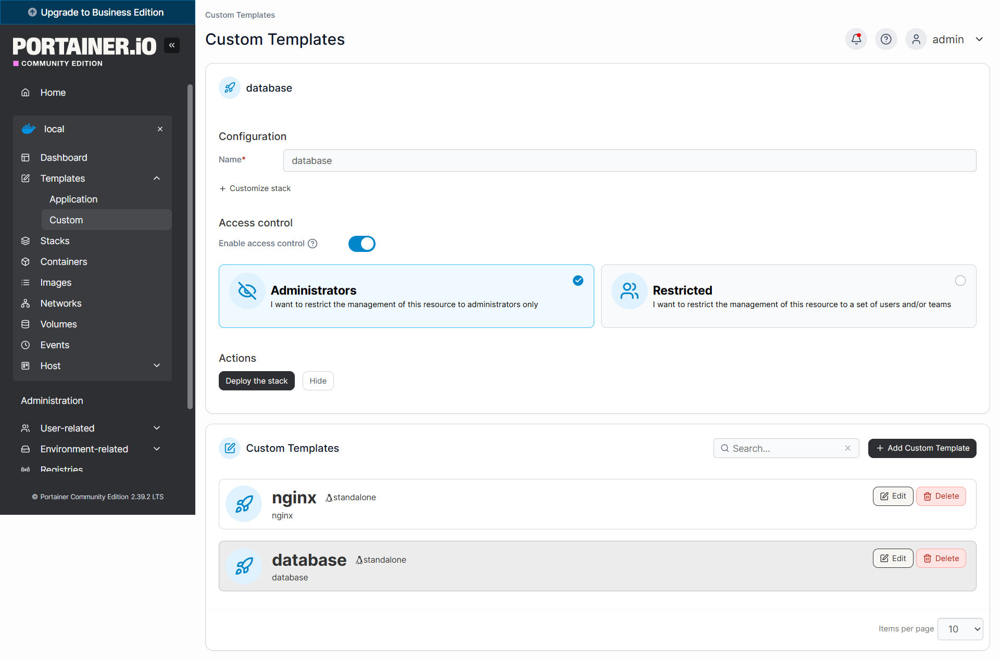

---

## Step 13 — Deploy the Stack

Click on the **database** template to open the deployment view. The stack name is pre-filled as `database`. Leave everything as is and click **Deploy the stack**.

Portainer creates the stack and immediately shows a green **Stack created** notification in the top right corner. In the Stacks list you can now see two stacks: `database` (just created, 2026-05-25 16:01:25) and `nginx` (from the previous chapter, 2026-05-20 23:53:39). Both are of type Compose.

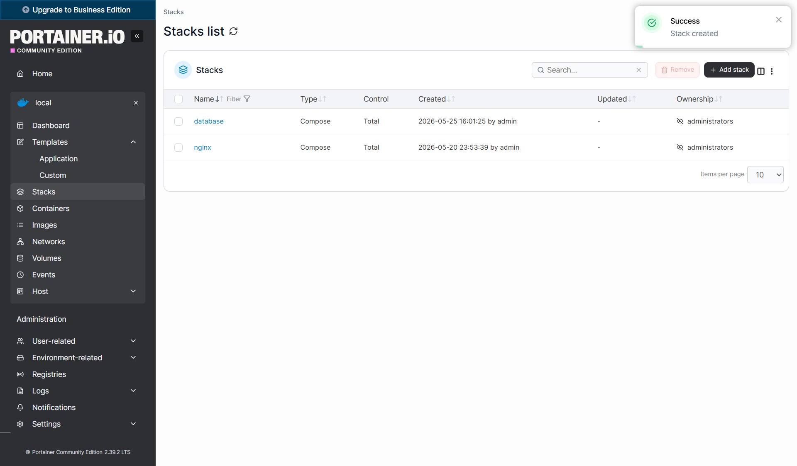

---

## Step 14 — Stack Details — Container Starting

Click on the **database** stack to open its detail view. You will see one container — `database` — with state **starting**. This is completely expected on the very first run: Oracle Database needs several minutes to create the datafiles, configure the PDB, and run its initialization scripts before it is ready to accept connections. The container is not stuck — it is working.

The image shown is `oracle/database:23.26.1-ee` and port `1521` is published to the host. These match exactly what we defined in the template.

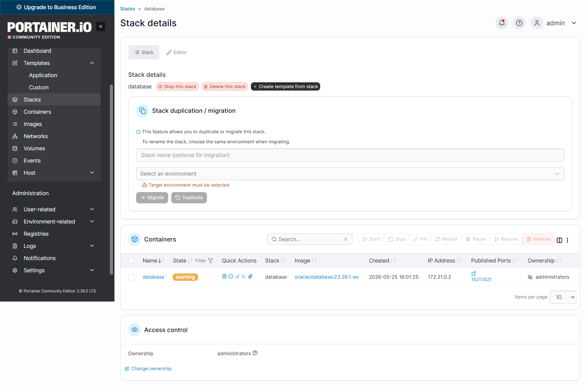

---

## Step 15 — Container Details

Click on the `database` container to open its full detail view. This page shows every aspect of the running container configuration — environment variables, volume mounts, network attachments, port bindings, and the restart policy. It is a useful reference to confirm that all settings from the Compose template were applied correctly.

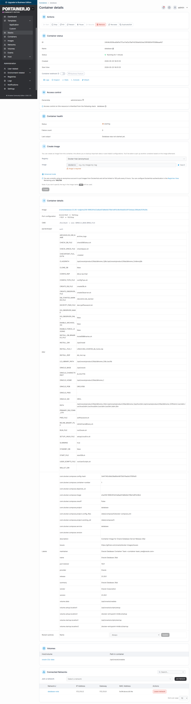

---

## Step 16 — Initialization in Progress

Navigate to **Containers → database → Logs** to watch the initialization live. Enable **Auto-refresh logs** so the view updates automatically. On the first start, Oracle runs a full database creation process inside the container. You will see progress messages like:

```
ORACLE EDITION: ENTERPRISE
Prepare for db operation
0% complete
Copying database files
   31% complete
Creating and starting Oracle instance
   32% complete
   36% complete
```

This initialization only happens **once**. Oracle creates the datafiles and stores them in the `oracle-23c-data` volume. All subsequent container restarts skip this phase and start in seconds. Do not stop or restart the container while this is running.

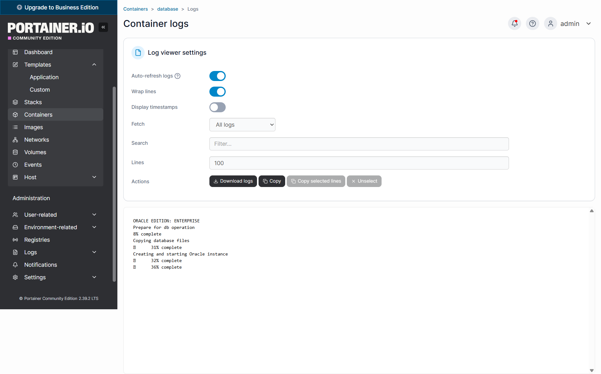

---

## Step 17 — Database Ready

When initialization is complete, the log output shows a sequence of successful configuration steps — pluggable database alterations, PL/SQL procedures, and grant statements — followed by:

```
Disconnected from Oracle Database 23ai Enterprise Edition Release 23.26.1.0 - Production
```

This final disconnection message means the initialization scripts have finished and the database is now fully operational. From this point on, Oracle is ready to accept connections on port `1521`.

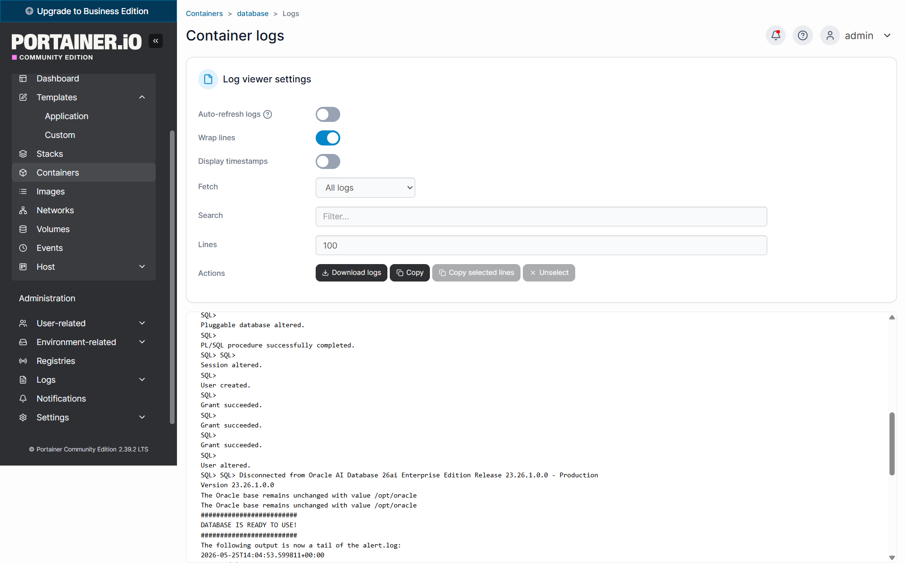

---

## Step 18 — Verify with SQL Developer

To confirm the database is reachable from outside the server, open **Oracle SQL Developer** and create a new connection with the following settings:

| Setting | Value |
|---------|-------|
| Connection name | `DEIPA_PROD_SYS` |
| Username | `sys` |
| Role | `SYSDBA` |
| Hostname | `212.132.107.231` (your server IP) |
| Port | `1521` |
| Service name | `orclpdb` |

Click **Test**. The status bar at the bottom of the dialog shows **Status: Erfolgreich** (Success). Oracle Database 23c Enterprise Edition is reachable from the outside world on port `1521`, and the pluggable database `ORCLPDB` is open and responding. Click **Save** to keep this connection for future use.

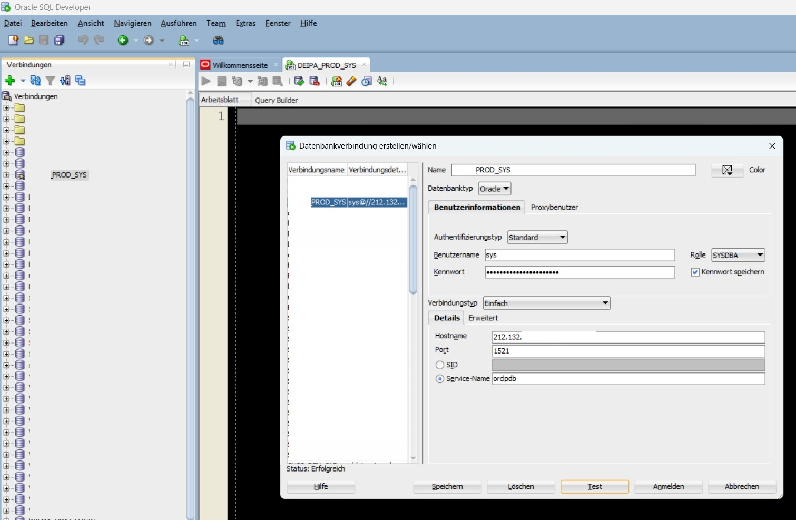

---

## Password Management

### How to Change the SYS Password

If you need to change the database password after the container is running — for example to rotate credentials or because you want to set a different password than the one used during setup — connect to SQL*Plus directly inside the container using the OS authentication shortcut. This bypasses the password entirely and logs you in as SYSDBA.

```bash
docker exec -it database sqlplus / as sysdba
```

Once connected, run the ALTER USER command with the new password:

```sql
ALTER USER SYS IDENTIFIED BY "your-new-password";
```

Type `exit` to disconnect.

> **Important:** After changing the password via SQL*Plus, also update the `ORACLE_PWD` value in the Portainer Custom Template. Otherwise the stored template will have a password that no longer matches the actual database — which can cause confusion when redeploying.

---

## Step 19 — All Containers Running

Navigate to **local → Containers** in Portainer to get a full overview of the current state. You should now see four containers, all with status **running**:

- `database` — Oracle Database 23c EE, status **healthy**, port `1521` published
- `nginx_app` — Nginx Proxy Manager, ports `80`, `443`, `81` published
- `nginx_db` — the MariaDB database used by Nginx Proxy Manager internally
- `portainer` — the Portainer container itself, port `9000` published

The `database` container shows **healthy** in green — this means Docker's built-in health check has confirmed that Oracle is up and accepting connections. This is the most reliable indicator that the database is fully ready.

With all four containers running, the core infrastructure of the database server is complete: container management (Portainer), reverse proxy (Nginx), and database (Oracle 23c) are all in place.

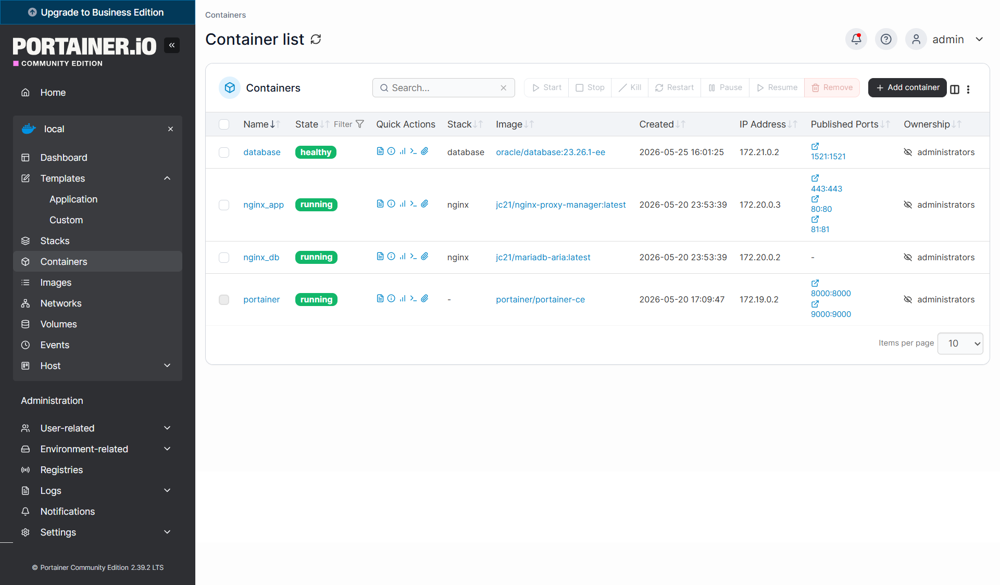

---

## Result

Oracle Database 23c Enterprise Edition is now running as a Docker container, fully initialized, and reachable on port `1521`. The key connection details for the next chapters are:

| Setting | Value |
|---------|-------|
| Container name | `database` |
| Hostname (within Docker network) | `database` |
| Oracle Listener Port | `1521` |
| SID | `ORCL` |
| PDB name | `ORCLPDB` |
| SYS password | *(the password you set in the template)* |
| Docker network | `database-ords` |
| Data volume | `oracle-23c-data` |

The next step is installing **Oracle APEX** into the `ORCLPDB` pluggable database — before ORDS can serve the application, APEX itself must be installed into the database schema. After that, ORDS (Oracle REST Data Services) is set up to connect to `ORCLPDB` on port `1521` via the shared `database-ords` Docker network and expose Oracle APEX over HTTP.
