# Oracle APEX 26.1 Installation

## What is Oracle APEX?

Oracle APEX (Application Express) is a low-code development platform built directly into Oracle Database. It allows developers to build and deploy web applications entirely through a browser — without a separate application server or middleware. APEX runs inside the database itself, which means every application, workspace, and piece of data lives directly in Oracle.

In our setup, Oracle Database 23ai ships with APEX already included in the database schema. However, the version that comes pre-installed may not be the latest release. In this chapter we download the current APEX 26.1 installer, run the installation into our PDB (`ORCLPDB`), configure REST services, set up the admin account, and copy the static image files to the host so ORDS can serve them later.

---

## Requirements

| Item | Details |
|------|---------|
| OS | Ubuntu 22.04 LTS |
| User | `root` |
| Database | Oracle 23.26.1-ee running as container `database` |
| PDB | `ORCLPDB` |
| Depends on | Docker, running Oracle Database container |

---

## Step 1 — Create the Working Directory

We create a dedicated folder on the host server for all APEX-related files. This keeps the setup organized and gives us a central place for the static image files that ORDS will need later.

```bash
cd /home/ && mkdir apex26 && cd apex26
```

The MobaXterm file browser on the left confirms the new `apex26` folder appeared under `/home/` alongside the existing `db23c` folder.

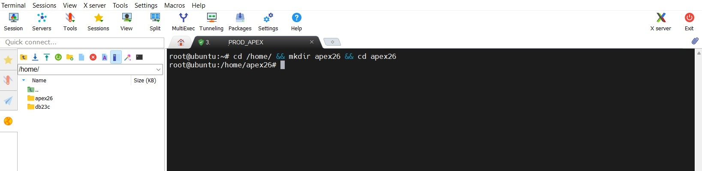

---

## Step 2 — Download and Unzip APEX Inside the Container

The APEX installer needs to run inside the Oracle Database container where SQL*Plus is available. We download the APEX 26.1 zip directly into the container's `/tmp` directory and unzip it there.

```bash
docker exec database bash -c "
  cd /tmp && \
  rm -rf apex apex.zip && \
  curl -L -o apex.zip 'https://download.oracle.com/otn_software/apex/apex_26.1.zip' && \
  echo 'Download complete!' && \
  unzip -q apex.zip && \
  echo 'Unpacking complete!'
"
```

The download completed at 52.6 MB/s in just 5 seconds — a total of 310 MB. Both `Download complete!` and `Unpacking complete!` confirm that the APEX files are now available at `/tmp/apex/` inside the container, ready for installation.

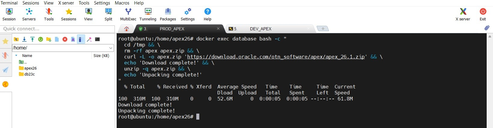

---

## Step 3 — Install APEX into the Database

Now we run the main APEX installation script `apexins.sql`. This script installs all APEX database objects — packages, views, synonyms, and data — into the pluggable database `ORCLPDB`. The four parameters tell Oracle where to store the APEX tablespaces and what the static files URL prefix will be.

```bash
docker exec database bash -c "
  cd /tmp/apex && \
  sqlplus sys/SYSPASSWORD@localhost:1521/ORCLPDB as sysdba << 'SQLEOF'
@apexins.sql SYSAUX SYSAUX TEMP /i/
EXIT;
SQLEOF
"
```

The parameters explained:
- `SYSAUX` — tablespace for APEX application objects
- `SYSAUX` — tablespace for APEX files
- `TEMP` — temporary tablespace
- `/i/` — the URL path where ORDS will serve the static image files

> This step takes **5–10 minutes**. You will see many lines of output as APEX installs its components. Do not interrupt the process.

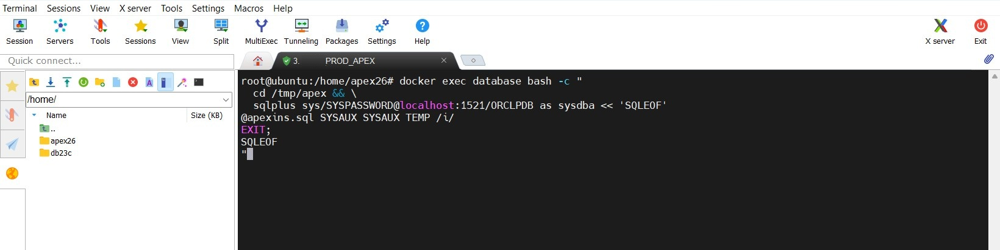

---

## Step 4 — Installation Complete

When `apexins.sql` finishes, the output shows a summary of all installation phases and a confirmation message:

```
Thank you for installing Oracle APEX 26.1.0
Oracle APEX is installed in the APEX_260100 schema.

The structure of the link to the Oracle APEX Administration Services is as follows:
http://host:port/ords/apex_admin

The structure of the link to the Oracle APEX development environment is as follows:
http://host:port/ords/apex
```

All **20 actions passed with 0 failures**, and the complete installation elapsed in **5.73 minutes**. APEX 26.1.0 is now installed in the `APEX_260100` schema inside `ORCLPDB`.

The URLs shown (`/ords/apex_admin` and `/ords/apex`) are the final access points — these will become live once ORDS is set up in the next chapter.

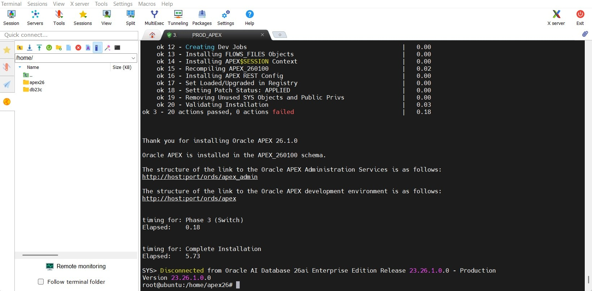

---

## Step 5 — Configure APEX REST Services

After the main installation, we run `apex_rest_config.sql` to configure the REST services that ORDS will use to communicate with APEX. This creates the necessary database objects and synonyms for the REST interface.

```bash
docker exec database bash -c "
  cd /tmp/apex && \
  sqlplus sys/SYSPASSWORD@localhost:1521/ORCLPDB as sysdba << 'SQLEOF'
@apex_rest_config.sql
EXIT;
SQLEOF
"
```

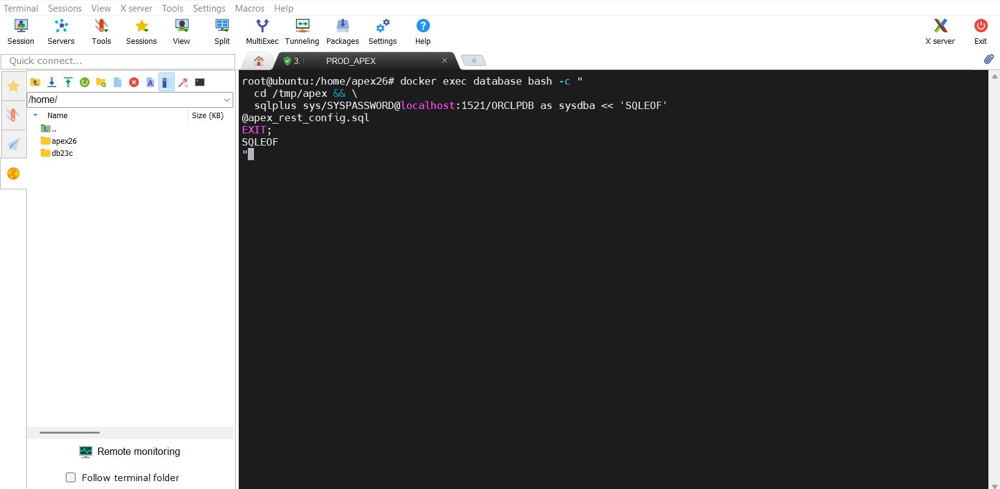

---

## Step 6 — REST Configuration Complete

The script completes successfully, creating a series of synonyms and finishing with two PL/SQL procedures:

```
Synonym created.  (x7)
Session altered.
PL/SQL procedure successfully completed.
PL/SQL procedure successfully completed.
```

This confirms that the REST interface between APEX and ORDS is correctly configured in the database.

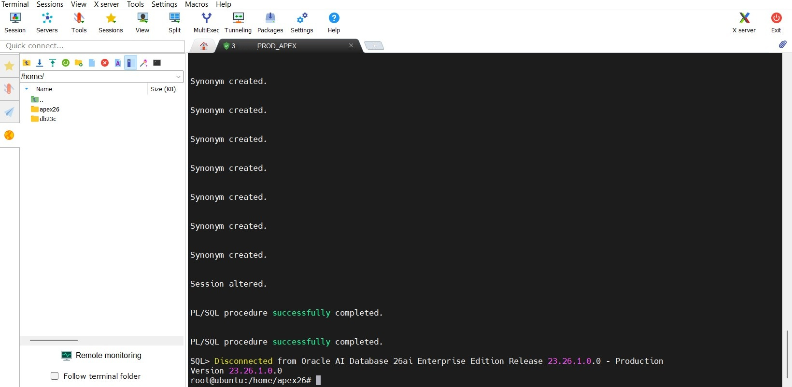

---

## Step 7 — Set the APEX Admin Password

With the database objects in place, we now set up the APEX instance administrator account. We use the interactive `apxchpwd.sql` script which creates the `ADMIN` user and prompts for username, email, and password.

```bash
docker exec -it database bash -c "
  cd /tmp/apex && \
  sqlplus sys/SYSPASSWORD@localhost:1521/ORCLPDB as sysdba \
  @apxchpwd.sql
"
```

> Note the `-it` flag — this script is interactive and requires a real terminal to read your input.

When prompted, enter:
- **Username** — press Enter to accept the default `ADMIN`
- **Email** — your email address
- **Password** — a strong password (minimum 12 characters, mixed case, numbers, and special characters)

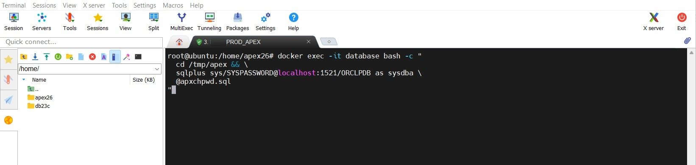

---

## Step 8 — Admin Account Created

After entering the details, the script confirms:

```
Created instance administrator ADMIN.
```

The APEX `ADMIN` account now exists in the `INTERNAL` workspace with the email and password you provided. This is the account you will use to log into APEX Administration Services at `http://host:port/ords/apex_admin`.

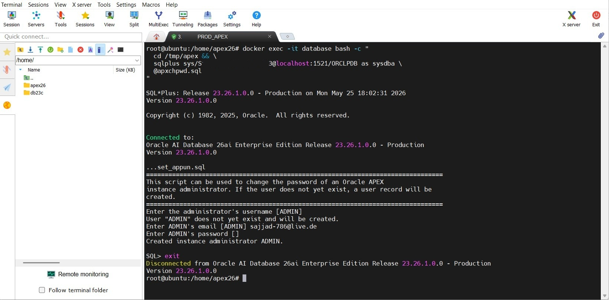

---

## Step 9 — Unlock APEX_PUBLIC_USER

The `APEX_PUBLIC_USER` database account is used by ORDS to connect to APEX. We unlock it now so ORDS can authenticate properly when we set it up in the next chapter.

```bash
docker exec -it database bash -c "
  sqlplus sys/SYSPASSWORD@localhost:1521/ORCLPDB as sysdba << 'SQLEOF'
ALTER USER APEX_PUBLIC_USER ACCOUNT UNLOCK;
COMMIT;
EXIT;
SQLEOF
"
```

The output confirms `User altered.` and `Commit complete.` — the account is now active.

> The other ORDS-related users (`ORDS_PUBLIC_USER`, `ORDS_METADATA`, `APEX_REST_PUBLIC_USER`) do not exist yet — they will be created automatically when ORDS is installed in the next chapter.

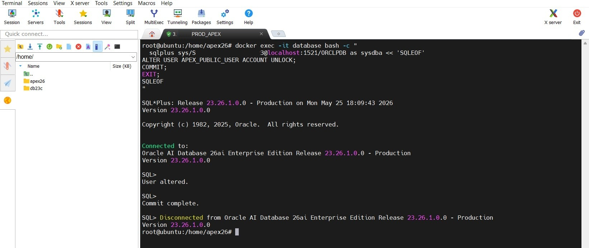

---

## Step 10 — Copy Static Image Files to Host

APEX uses a large set of static files — JavaScript, CSS, images, and fonts — that are served by ORDS under the `/i/` URL path. These files live inside the container at `/tmp/apex/images/`. We copy them to the host server so they can be mounted into the ORDS container later.

```bash
docker cp database:/tmp/apex/images /home/apex26/images && \
echo "Done! Images at /home/apex26/images"
```

The copy transferred **550 MB** successfully. The static files are now permanently stored at `/home/apex26/images/` on the host — independent of the container, so they survive container restarts and rebuilds.

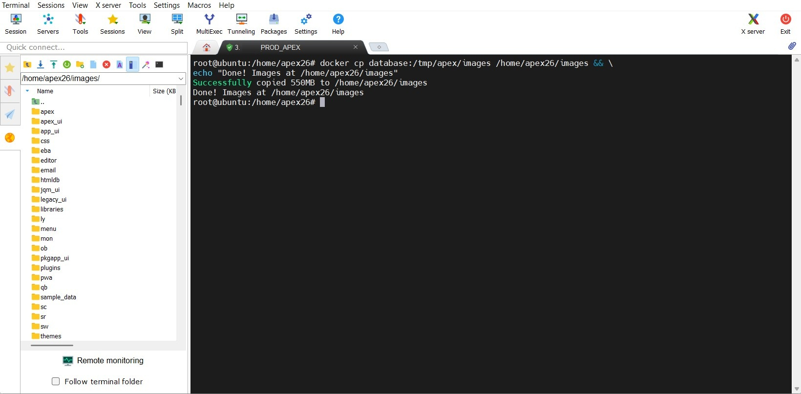

---

## Step 11 — Verify the Installation

To confirm everything is set up correctly, we query the `WWV_FLOW_FND_USER` table — the APEX user table — to check that the ADMIN account exists and is active. This query works dynamically across all APEX versions without hardcoding the schema name.

```bash
docker exec -it database bash -c "
  sqlplus sys/SYSPASSWORD@localhost:1521/ORCLPDB as sysdba << 'SQLEOF'
SELECT USER_NAME, EMAIL_ADDRESS, ACCOUNT_LOCKED
FROM WWV_FLOW_FND_USER
WHERE USER_NAME = 'ADMIN'
AND SECURITY_GROUP_ID = 10;
EXIT;
SQLEOF
"
```

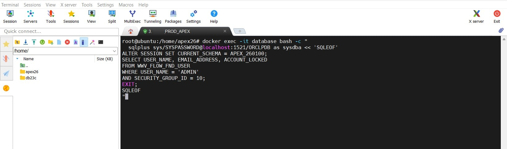

---

## Step 12 — Verification Successful

The query returns exactly what we expect:

```
USER_NAME    EMAIL_ADDRESS          ACCOUNT_LOCKED
-----------  ---------------------  --------------
ADMIN        sajjad-786@live.de     N
```

- `USER_NAME = ADMIN` ✅
- `EMAIL_ADDRESS` is set correctly ✅
- `ACCOUNT_LOCKED = N` — account is active and not locked ✅

Oracle APEX 26.1.0 is fully installed and the admin account is ready.

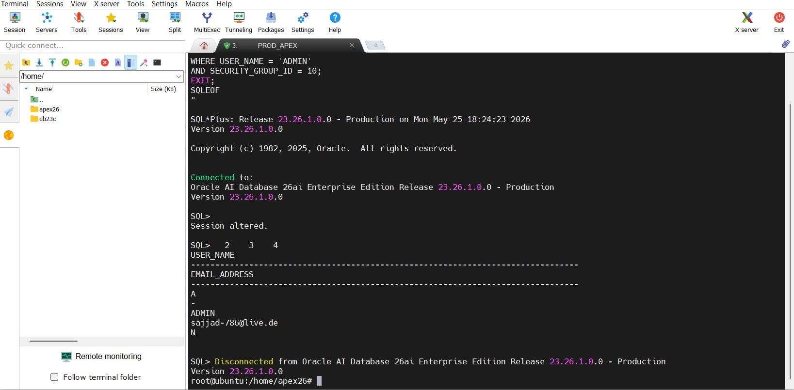

---

## Result

Oracle APEX 26.1.0 is installed in the `APEX_260100` schema inside `ORCLPDB`. The key facts for the next chapters:

| Setting | Value |
|---------|-------|
| APEX Version | 26.1.0 |
| APEX Schema | `APEX_260100` |
| PDB | `ORCLPDB` |
| Admin User | `ADMIN` |
| Static files on host | `/home/apex26/images` |
| Static files URL prefix | `/i/` |
| Admin URL (after ORDS) | `http://host:port/ords/apex_admin` |
| APEX URL (after ORDS) | `http://host:port/ords/apex` |

The next chapter covers **ORDS (Oracle REST Data Services)** — the component that connects to `ORCLPDB` on port `1521`, serves the APEX static files from `/home/apex26/images`, and exposes Oracle APEX over HTTP.

---

## Password Management

### How to Reset the APEX Admin Password

If you have forgotten the APEX instance administrator password, you need to re-download the APEX installer inside the database container and run the interactive `apxchpwd.sql` script. This script works regardless of the current password — it overwrites it directly in the database. No knowledge of the old password is required.

**Step 1 — Re-download and unzip APEX inside the container:**

```bash
docker exec database bash -c "
  cd /tmp && \
  rm -rf apex apex.zip && \
  curl -L -o apex.zip 'https://download.oracle.com/otn_software/apex/apex_26.1.zip' && \
  unzip -q apex.zip && \
  echo 'Ready!'
"
```

The download is 310 MB and completes in around 6 seconds on a fast connection. When you see `Ready!`, the APEX files are available at `/tmp/apex/` inside the container.

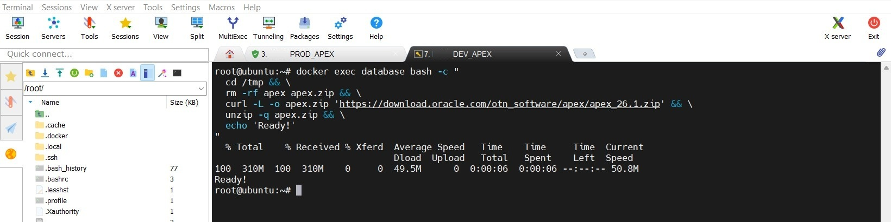

**Step 2 — Run the password reset script interactively:**

```bash
docker exec -it database bash -c "
  cd /tmp/apex && \
  sqlplus sys/SYSPASSWORD@localhost:1521/ORCLPDB as sysdba @apxchpwd.sql
"
```

> Note the `-it` flag — this script requires an interactive terminal to read your input.

When prompted, enter:
- **Username** — press Enter to keep the default `ADMIN`
- **Email** — your email address
- **Password** — your new password (minimum 12 characters, mixed case, numbers, and special characters)

The script confirms: `Changed password of instance administrator ADMIN.`

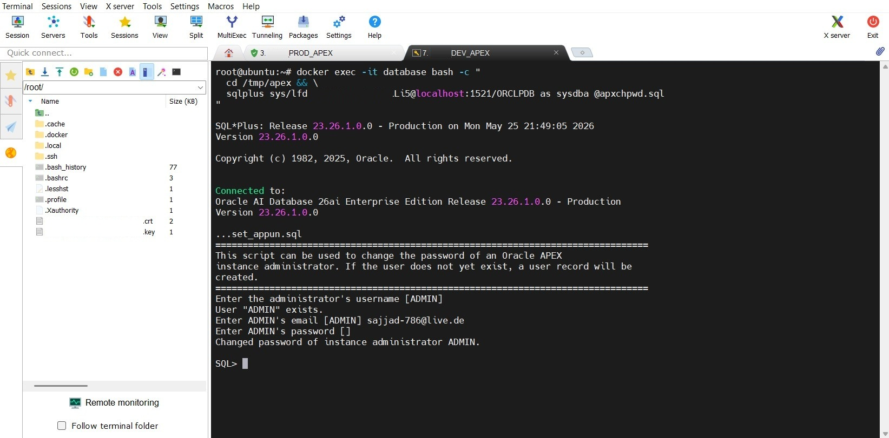

You can now log in at `http://<YOUR-SERVER-IP>:8181/ords/apex_admin` with the new password.


---

[← 03 Oracle Database](../03_database/database.md) | [↑ Back to Overview](../../../README.md) | [→ 05 ORDS](../05_ords/ords.md)
