# ORDS (Oracle REST Data Services) 26.1

## What is ORDS?

ORDS — Oracle REST Data Services — is the component that makes Oracle APEX accessible over a standard web browser. APEX itself lives entirely inside the Oracle Database, but it has no built-in web server. ORDS fills that gap: it connects to the database on port 1521, translates incoming HTTP requests into database calls, and sends the responses back as web pages. Without ORDS, APEX cannot be reached at all.

In our setup, ORDS runs as a Docker container. It shares the `database-ords` Docker network with the Oracle Database container, which means it can reach the database simply by hostname — no IP address, no firewall rule. ORDS also serves the APEX static files (JavaScript, CSS, images) from the `/home/apex26/images` folder we copied in the previous chapter. Those files are mounted directly into the ORDS container.

The result of this chapter: Oracle APEX is live and reachable at `http://<YOUR-SERVER-IP>:8181/ords/apex`.

---

## Requirements

| Item | Details |
|------|---------|
| OS | Ubuntu 22.04 LTS |
| User | `root` |
| Oracle Container Registry account | Required to pull the official ORDS image |
| Database | Oracle 23.26.1-ee running as container `database` |
| APEX | Oracle APEX 26.1.0 installed in `ORCLPDB` |
| Static files | `/home/apex26/images` on the host |
| Docker network | `database-ords` (already created by the database stack) |

---

## Step 1 — Pull the ORDS Image from Oracle Container Registry

The official ORDS Docker image is not on Docker Hub — it is published on Oracle's own container registry at `container-registry.oracle.com`. To pull it, you must first have an Oracle account and accept the license agreement on the Oracle Container Registry website.

Once you have accepted the license, log in from the terminal and pull the image:

```bash
docker login container-registry.oracle.com

docker pull container-registry.oracle.com/database/ords:latest
```

The pull downloads all image layers one by one. In our case all layers completed successfully — you can see each one reaching `Pull complete` status in sequence. The total download is several hundred MB and takes a few minutes depending on your connection speed.

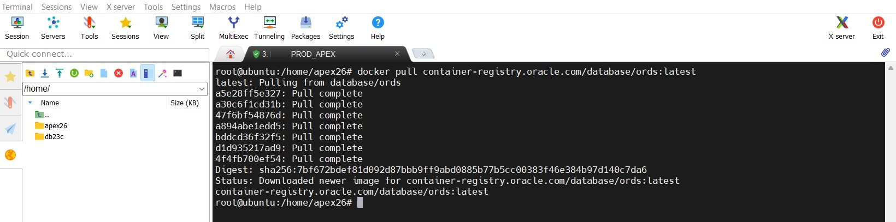

---

## Step 2 — Verify the ORDS Version

Before doing anything else with the image, we run a quick version check. This confirms that the image is intact and tells us exactly which ORDS release we have — without starting a full container or touching the database.

```bash
docker run --rm container-registry.oracle.com/database/ords:latest ords version
```

The `--rm` flag means Docker removes the temporary container immediately after the command finishes — nothing is left behind. The output confirms:

```
ORDS: Release 26.1 Production
```

This is Oracle REST Data Services 26.1, matching our APEX 26.1.0 installation. The versions align, so we can proceed.

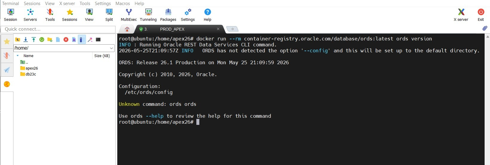

---

## Step 3 — Tag the Image with a Local Name

We rename the image from its long Oracle registry path to a short, clean local name: `ords-26.1:latest`. This makes the image easier to reference in Portainer templates and Docker commands, and it avoids having to type the full registry URL every time.

```bash
docker image tag container-registry.oracle.com/database/ords:latest ords-26.1:latest
docker rmi container-registry.oracle.com/database/ords:latest
```

The first command creates the new tag pointing to the same image layers. The second removes the original long-form tag to keep the local image list clean — the image data itself is not deleted, only the old label is removed. The terminal confirms `Untagged: container-registry.oracle.com/database/ords:latest`. From now on the image is known simply as `ords-26.1:latest`.

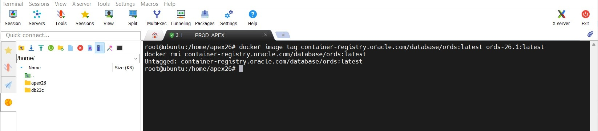

---

## Step 4 — Create the ORDS Custom Template in Portainer

Just like the database, we deploy ORDS using a Custom Template in Portainer. This saves the full configuration so it can be redeployed in two clicks at any time.

Open Portainer at `http://<YOUR-SERVER-IP>:9000` and navigate to **local → Templates → Custom**, then click **Add Custom Template**. Fill in:

- **Title** — `ords`
- **Description** — `ords`
- **Platform** — `Linux`
- **Type** — `Standalone / Podman`

In the **Web editor**, paste the following Docker Compose configuration:

```yaml
version: '3.9'
services:
  ords:
    image: ords-26.1:latest
    container_name: ords
    restart: always
    ports:
      - "8181:8080"
    environment:
      DBHOST: database
      DBPORT: 1521
      DBSERVICENAME: ORCLPDB
      ORACLE_PWD: SYSPASSWORD
    volumes:
      - ords-config:/etc/ords/config
      - /home/apex26/images:/opt/oracle/apex/images
    networks:
      - database-ords

networks:
  database-ords:
    external: true
    name: database-ords

volumes:
  ords-config:
    name: ords-config
```

A few things worth understanding about this configuration:

- `DBHOST: database` — this is the container name of the Oracle Database container. Docker resolves it automatically within the shared `database-ords` network. No IP address is needed.
- `DBSERVICENAME: ORCLPDB` — we connect to the pluggable database, not the CDB root. This is where APEX is installed.
- `ORACLE_PWD: SYSPASSWORD` — replace this with your actual SYS password. ORDS uses it to connect and configure itself on the first start.
- Port `8181:8080` — ORDS listens internally on 8080. We expose it as 8181 on the host so it does not conflict with any other service.
- `/home/apex26/images:/opt/oracle/apex/images` — the APEX static files are mounted from the host directly into the container. ORDS serves these under the `/i/` URL path.
- `database-ords: external: true` — the Docker network already exists (created by the database stack). We declare it as external so Portainer does not try to create it again.

> Replace `SYSPASSWORD` with your actual SYS password before saving.

Under **Access control**, leave it set to **Administrators**. Click **Update custom template** to save.

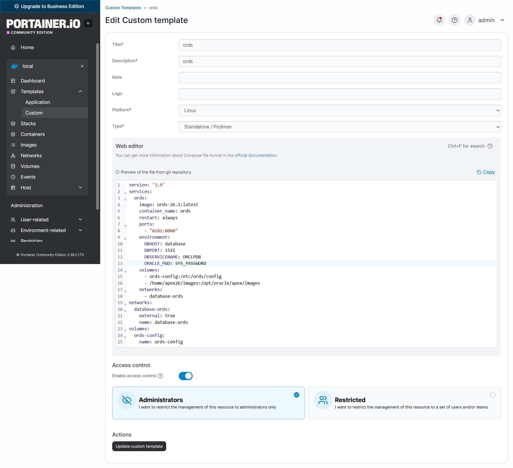

---

## Step 5 — Deploy the Stack

The `ords` template now appears in the Custom Templates list alongside `nginx` and `database`. Click on the **ords** template to open the deployment view. The stack name is pre-filled as `ords`. Leave everything as is and click **Deploy the stack**.

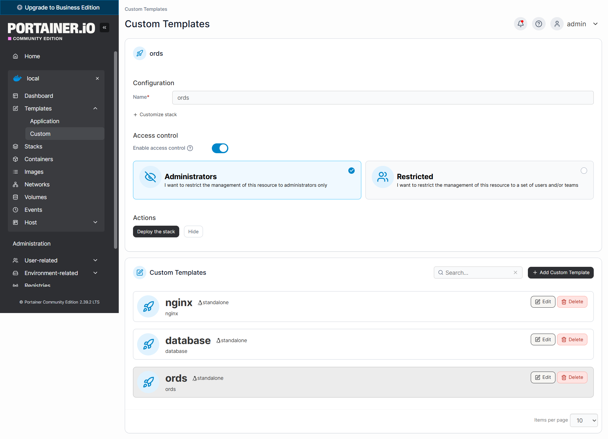

---

## Step 6 — Stack Created Successfully

Portainer creates the stack and immediately shows a green **Stack created** notification in the top right corner. The Stacks list now shows all three stacks:

- `ords` — just created, `2026-05-25 23:12:53`
- `database` — from the previous chapter, `2026-05-25 16:01:25`
- `nginx` — from the earlier chapter, `2026-05-20 23:53:39`

All three are of type Compose and under administrator control.

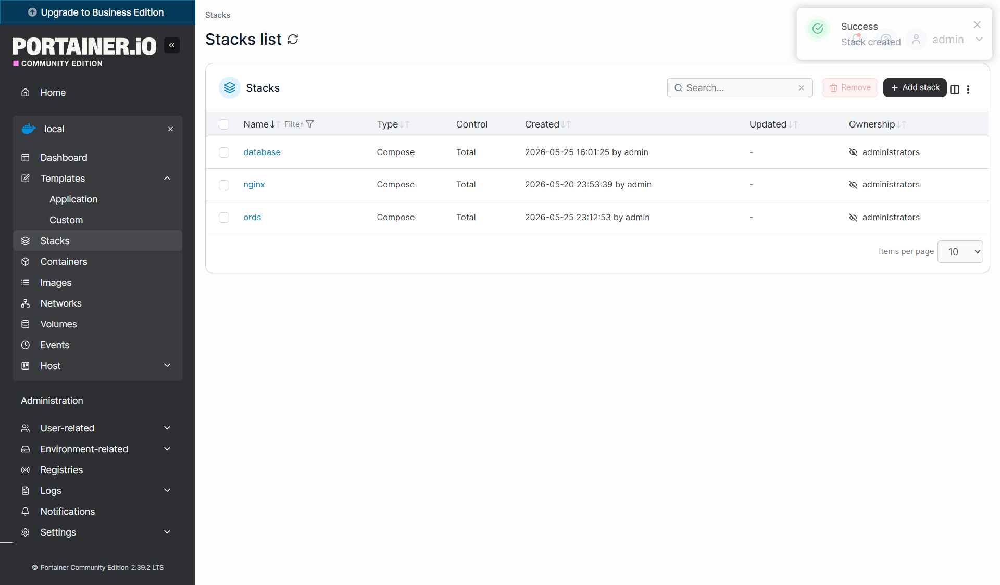

---

## Step 7 — Stack Details — ORDS Running

Click on the **ords** stack to open its detail view. You will see one container — `ords` — with state **running**. Unlike the database container, ORDS starts very quickly on the first run: it connects to the database, reads its configuration, and begins serving requests within seconds.

The image shown is `ords-26.1:latest` — the locally tagged name we created in Step 3. Port `8181` is published to the host.

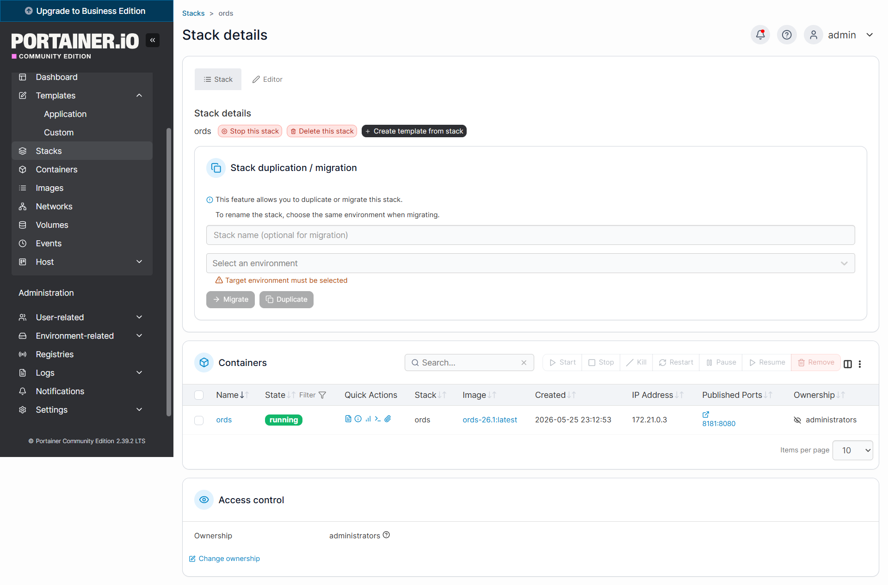

---

## Step 8 — Container Details

Click on the `ords` container to open its full detail view. This page confirms every aspect of the deployed configuration:

- **Port** — `0.0.0.0:8181 → 8080/tcp`, exactly as configured
- **Environment** — `DBHOST=database`, `DBPORT=1521`, `DBSERVICENAME=ORCLPDB`, `ORDS_VER=26.1.1`
- **Volumes** — `ords-config` mounted at `/etc/ords/config`, and `/home/apex26/images` mounted at `/opt/oracle/apex/images`
- **Network** — connected to `database-ords`, IP address `172.21.0.3`

Everything matches the template exactly. The `database-ords` network entry at the bottom confirms that the ORDS container is on the same network as the Oracle Database container — this is what allows `DBHOST: database` to resolve correctly.

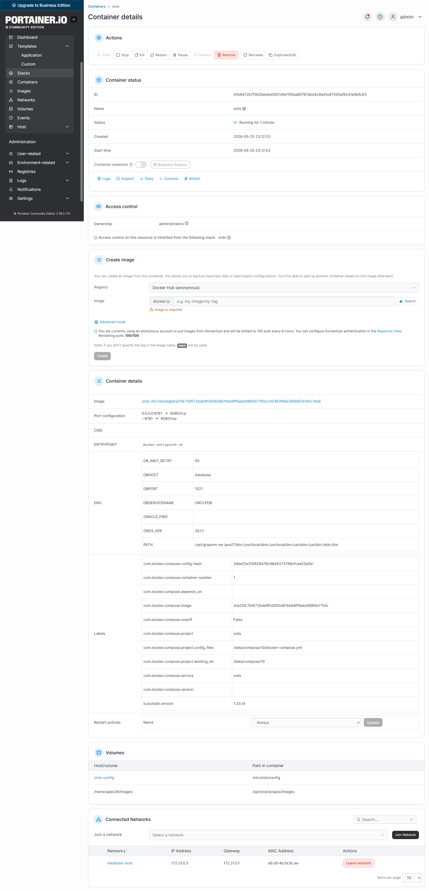

---

## Step 9 — ORDS Logs — Initialization Complete

Navigate to **Containers → ords → Logs** and enable **Auto-refresh logs**. On the first start, ORDS connects to the database, reads the APEX configuration, and starts its internal services. The log output confirms a successful startup:

```
Oracle REST Data Services Initialized
Oracle REST Data Services version : 26.1.1.1...
...
TransactionMonitor 1
ReportMonitor 1
WatchingMonitor 1
```

These three monitor processes — TransactionMonitor, ReportMonitor, WatchingMonitor — are the background threads that ORDS uses to manage database sessions and handle long-running requests. Seeing all three start means ORDS is fully operational and actively connected to the database.

> If you see connection errors in the logs, check that the `database` container is running and healthy, and that the `ORACLE_PWD` in the template matches the actual SYS password.

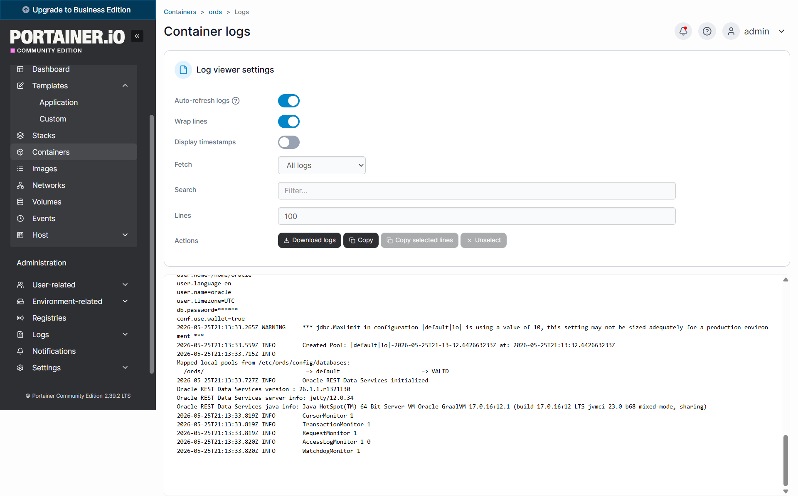

---

## Step 10 — All Containers Running

Navigate to **local → Containers** to get a full overview. The complete stack is now in place — five containers, all with status **running**:

- `database` — Oracle Database 23c EE, status **healthy**, port `1521`
- `nginx_app` — Nginx Proxy Manager, ports `80`, `443`, `81`
- `nginx_db` — MariaDB used internally by Nginx Proxy Manager
- `ords` — Oracle REST Data Services 26.1, port `8181`
- `portainer` — Portainer container management, port `9000`

The `database` container shows **healthy** in green — Docker's built-in health check confirms the database is fully accepting connections. The `ords` container is running alongside it, connected via the shared `database-ords` network.

With all five containers running, the complete application stack is assembled: Portainer manages it all, Nginx handles TLS termination, Oracle Database holds the data, and ORDS bridges APEX to the web.

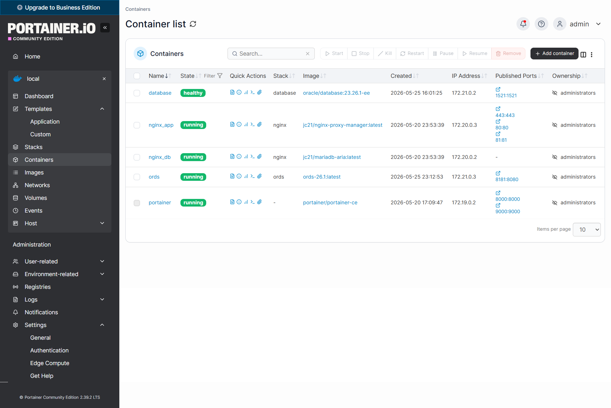

---

## Step 11 — Oracle APEX is Live

Open your browser and navigate to:

```
http://<YOUR-SERVER-IP>:8181/ords/apex
```

The Oracle APEX login page appears — the familiar dark background with the Oracle APEX logo and the three-field login form for **Workspace**, **Username**, and **Password**.

This page being visible confirms the entire chain is working: the browser reaches ORDS on port 8181, ORDS serves the APEX application from `ORCLPDB`, and the static files are served from the mounted `/home/apex26/images` directory.

To log in as the instance administrator, use:
- **Workspace** — `internal`
- **Username** — `ADMIN`
- **Password** — the password you set with `apxchpwd.sql` in the previous chapter

For APEX Administration Services, navigate to `http://<YOUR-SERVER-IP>:8181/ords/apex_admin` instead.

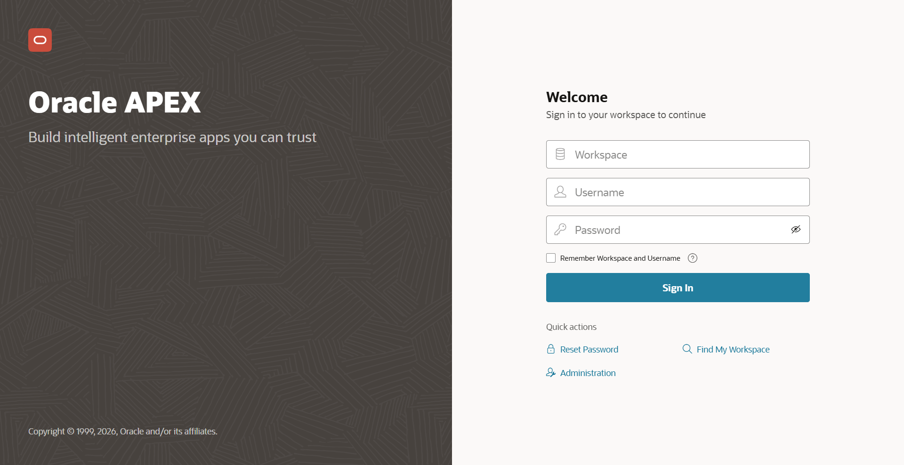

---

## Step 12 — Administration Services Login Page

The APEX Administration Services login at `/ords/apex_admin` looks slightly different from the regular workspace login. It shows only two fields — **Username** and **Password** — with a **Sign In to Administration** button. There is no Workspace field here because Administration Services always uses the `INTERNAL` workspace automatically.

Use this URL when you need to:
- Manage workspaces (create, lock, remove)
- Monitor instance activity
- Configure instance settings
- Reset workspace admin passwords

```
http://<YOUR-SERVER-IP>:8181/ords/apex_admin
```

- **Username** — `ADMIN`
- **Password** — the password set with `apxchpwd.sql`

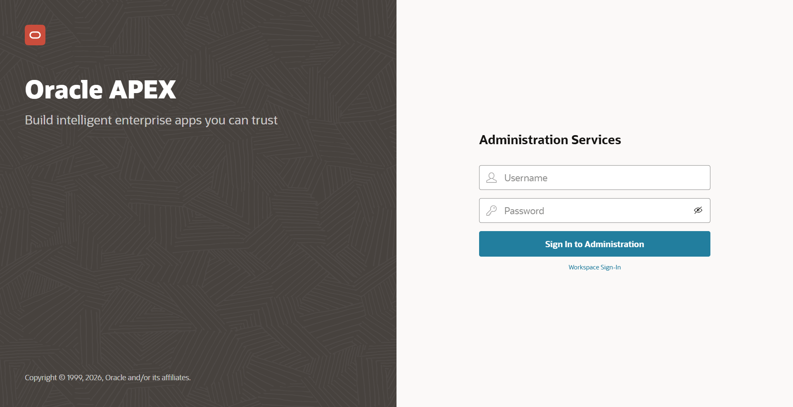

---

## Password Management

### How to Reset the APEX Admin Password

If you have forgotten the APEX instance administrator password, the only reliable way to reset it is to re-download the APEX installer inside the database container and run `apxchpwd.sql` interactively. No knowledge of the old password is required.

**Step 1 — Re-download and unzip APEX inside the container:**

```bash
docker exec database bash -c "
  cd /tmp && \
  rm -rf apex apex.zip && \
  curl -L -o apex.zip 'https://download.oracle.com/otn_software/apex/apex_26.1.zip' && \
  unzip -q apex.zip && \
  echo 'Ready!'
"
```

The download is 310 MB and completes in around 6 seconds on a fast connection. When `Ready!` appears, the APEX files are at `/tmp/apex/` inside the container.

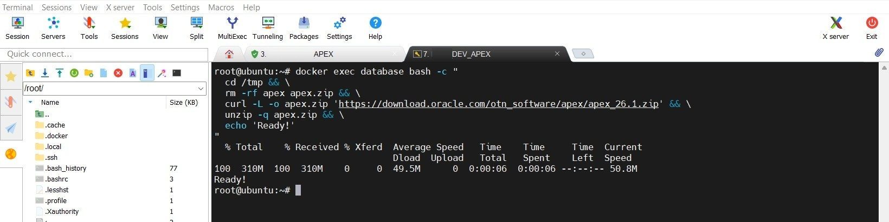

**Step 2 — Run the password reset script interactively:**

```bash
docker exec -it database bash -c "
  cd /tmp/apex && \
  sqlplus sys/SYSPASSWORD@localhost:1521/ORCLPDB as sysdba @apxchpwd.sql
"
```

> Note the `-it` flag — this script requires an interactive terminal to read your input.

When prompted:
- **Username** — press Enter to keep the default `ADMIN`
- **Email** — your email address
- **Password** — your new password (minimum 12 characters, mixed case, numbers, special characters)

The script confirms: `Changed password of instance administrator ADMIN.`

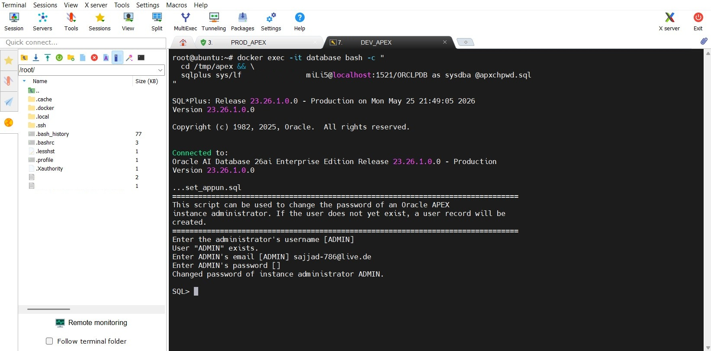

You can now log in at `http://<YOUR-SERVER-IP>:8181/ords/apex_admin` with the new password.

---

## Troubleshooting — SSL Login Error with Custom Domain

### Symptom

After switching from the direct server IP (`http://SERVER-IP:8181/ords/apex`) to the public domain with HTTPS (`https://prod-app.dipaapp.de/ords/apex`), the APEX login page loads correctly — but immediately after submitting the login credentials, the browser is redirected to a broken URL and shows an error page at:

```
https://prod-app.dipaapp.de/ords/wwv_flow_accept
```

The page displays an ORDS or APEX error instead of the workspace home screen.

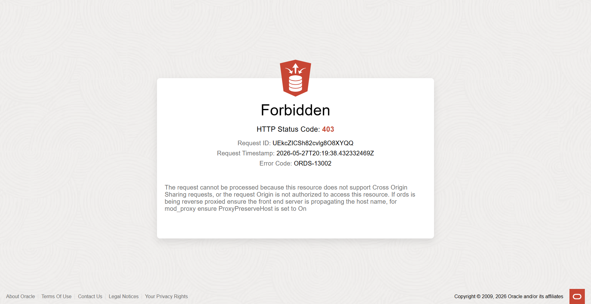

### Root Cause

ORDS is running inside Docker and receives HTTP traffic from Nginx on port 8080. Nginx terminates the HTTPS connection and forwards the request as plain HTTP — ORDS never sees the original HTTPS connection. Because ORDS does not know it is sitting behind an HTTPS reverse proxy, it generates redirect and callback URLs using `http://` instead of `https://`. The browser, already on `https://`, rejects or mishandles the mismatched redirect.

The fix is to locate the ORDS configuration file and tell ORDS to trust the forwarded HTTPS headers from Nginx.

### Fix — Edit the ORDS Settings XML

**Step 1 — Find the ORDS config volume on the host:**

The `ords-config` Docker volume is mounted into the container at `/etc/ords/config`. On the host, the volume data lives at:

```bash
docker volume inspect ords-config
# "Mountpoint": "/var/lib/docker/volumes/ords-config/_data"
```

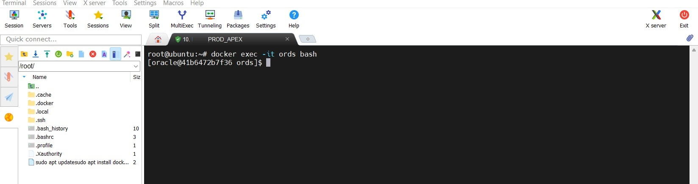

**Step 2 — Locate the settings.xml file:**

Navigate to the ORDS pool configuration directory inside the volume:

```bash
find /var/lib/docker/volumes/ords-config/_data -name "*.xml" | sort
```

The relevant file is `settings.xml` inside the database pool folder:

```
/var/lib/docker/volumes/ords-config/_data/databases/default/pool.xml
```

or

```
/var/lib/docker/volumes/ords-config/_data/global/settings.xml
```

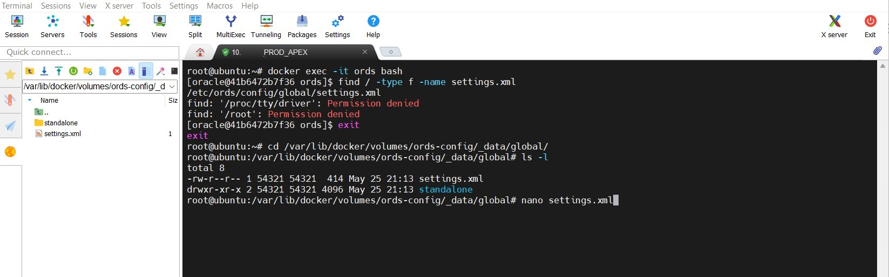

**Step 3 — Add the SSL configuration entry:**

Open the file and add the following entry inside the `<properties>` block. This tells ORDS that the connection is coming in over HTTPS even though the internal traffic is HTTP:

```bash
# Edit directly on the host (volume is accessible without entering the container)
nano /var/lib/docker/volumes/ords-config/_data/databases/default/pool.xml
```

Add inside `<properties>`:

```xml
<entry key="security.verifySSL">false</entry>
```

The full file structure looks like:

```xml
<?xml version="1.0" encoding="UTF-8"?>
<!DOCTYPE properties SYSTEM "http://java.sun.com/dtd/properties.dtd">
<properties>
  <entry key="db.hostname">database</entry>
  <entry key="db.port">1521</entry>
  <entry key="db.servicename">ORCLPDB</entry>
  <entry key="security.verifySSL">false</entry>
</properties>
```

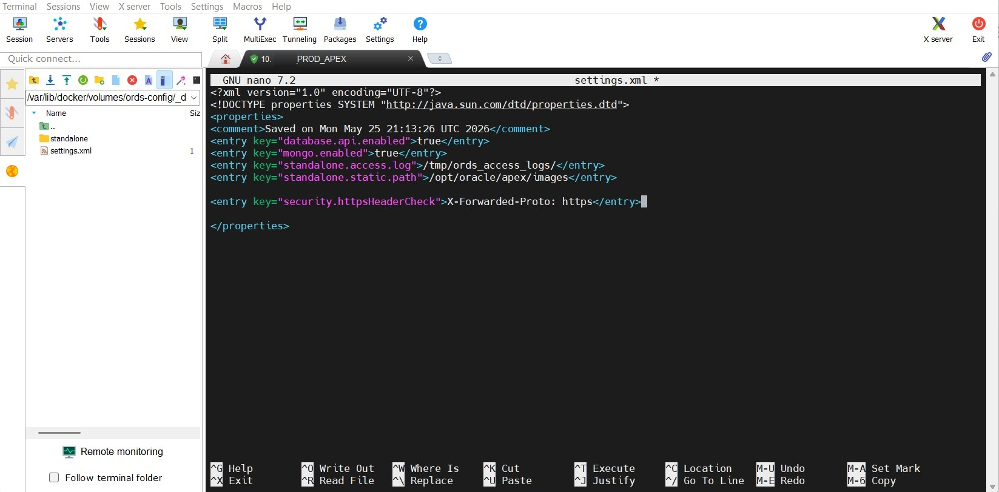

**Step 4 — Restart the ORDS container:**

```bash
docker restart ords
```

Wait 10–15 seconds for ORDS to reinitialize and reconnect to the database.

**Step 5 — Verify APEX works with SSL:**

Open a browser and navigate to:

```
https://prod-app.dipaapp.de/ords/apex
```

Log in with workspace `internal`, username `ADMIN`, and your password. The APEX workspace home loads correctly over HTTPS — the login redirect now generates the correct `https://` callback URL.

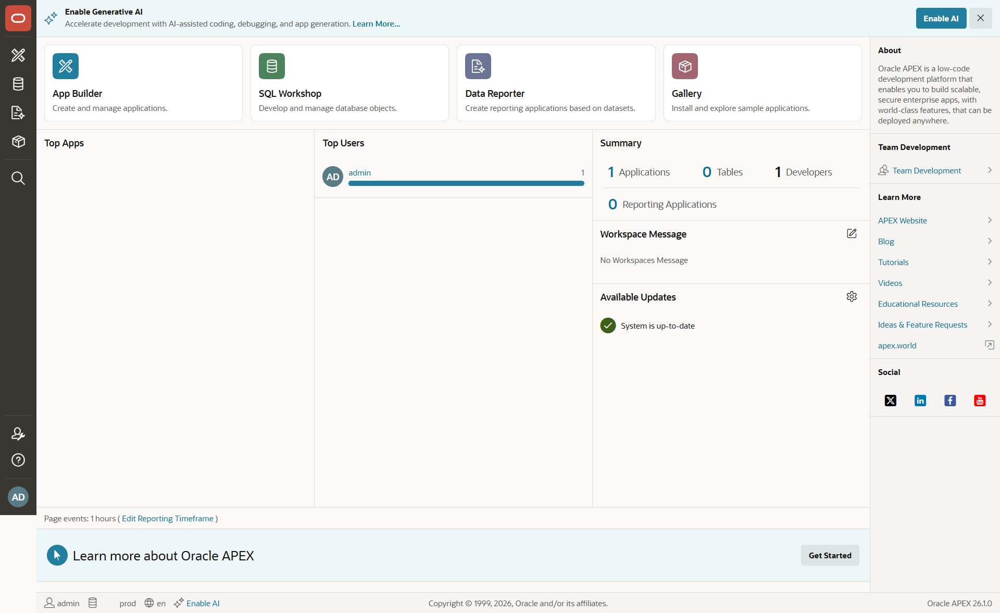

---

## Result

ORDS 26.1 is running as a Docker container, connected to the Oracle Database via the `database-ords` internal network, and serving Oracle APEX over HTTP on port 8181. The key facts for the next chapter:

| Setting | Value |
|---------|-------|
| ORDS Version | 26.1.1 |
| Container name | `ords` |
| Host port | `8181` |
| Internal port | `8080` |
| Docker network | `database-ords` |
| Config volume | `ords-config` |
| Static files | `/home/apex26/images` → `/opt/oracle/apex/images` |
| APEX URL (direct) | `http://<YOUR-SERVER-IP>:8181/ords/apex` |
| APEX URL (via domain) | `https://prod-app.dipaapp.de/ords/apex` |
| Admin URL (direct) | `http://<YOUR-SERVER-IP>:8181/ords/apex_admin` |

The next chapter covers **Tailscale** — the private VPN we use to securely expose Portainer and Nginx Proxy Manager to the outside world without opening additional public ports.
