# Tailscale, Domain & Firewall Setup

## What This Chapter Covers

Getting services reachable by name — not raw IP addresses — requires three things working together: DNS records that point domain names to the right servers, a VPN layer that keeps admin tools private, and firewall rules that close every port that should not be publicly reachable.

The domain `dipaapp.de` is managed via Strato. Public-facing services get A records pointing to the server's public IP. Private admin tools (Nginx Proxy Manager, Portainer) are exposed exclusively through **Tailscale Services** — a feature of Tailscale that gives each service its own stable `.ts.net` hostname, reachable only from inside the VPN tunnel. Finally, `iptables` rules in the `DOCKER-USER` chain lock down every admin port at the kernel level so that nothing reaches Docker containers from the public internet.

The end result: no admin panel is ever accessible from the public internet, while all services are reachable by clean domain names from any Tailscale-connected device.

---

## Requirements

| Item | Details |
|------|---------|
| OS | Ubuntu 22.04 LTS |
| User | `root` |
| Domain | `dipaapp.de` (managed via Strato) |
| Tailscale account | Free account at tailscale.com |
| Nginx Proxy Manager | Running as container `nginx_app` |
| Portainer | Running as container `portainer` |

---

## Part 1 — DNS Setup in Strato

### Subdomain Overview

The subdomains for the APEX server are created upfront in the Strato DNS panel for `dipaapp.de`. Public-facing services get A records pointing to the server's public IP. The database port is only accessible via its Tailscale IP — a `100.x.x.x` address that is only routeable from inside the Tailscale VPN even if it appears in a public DNS record.

| Subdomain | Points to | Access | Purpose |
|-----------|-----------|--------|---------|
| `prod-app.dipaapp.de` | Public IP of APEX server | Public | Oracle APEX application |
| `prod-apex-db.dipaapp.de` | Tailscale IP of APEX server | VPN only | Oracle DB port 1521 (SQL Developer) |

> The PDF server subdomains (`prod-pdf-*`) are configured separately in the `02_pdf-server` chapter.

### Step 1 — Create Subdomains in Strato

Open the Strato customer panel → **Domains → Domainverwaltung → dipaapp.de → DNS tab**. For each subdomain, click **Subdomain anlegen** and enter the name. Set the A record target to the server's public IP for `prod-app`, and the Tailscale IP (`100.93.172.16`) for `prod-apex-db`.

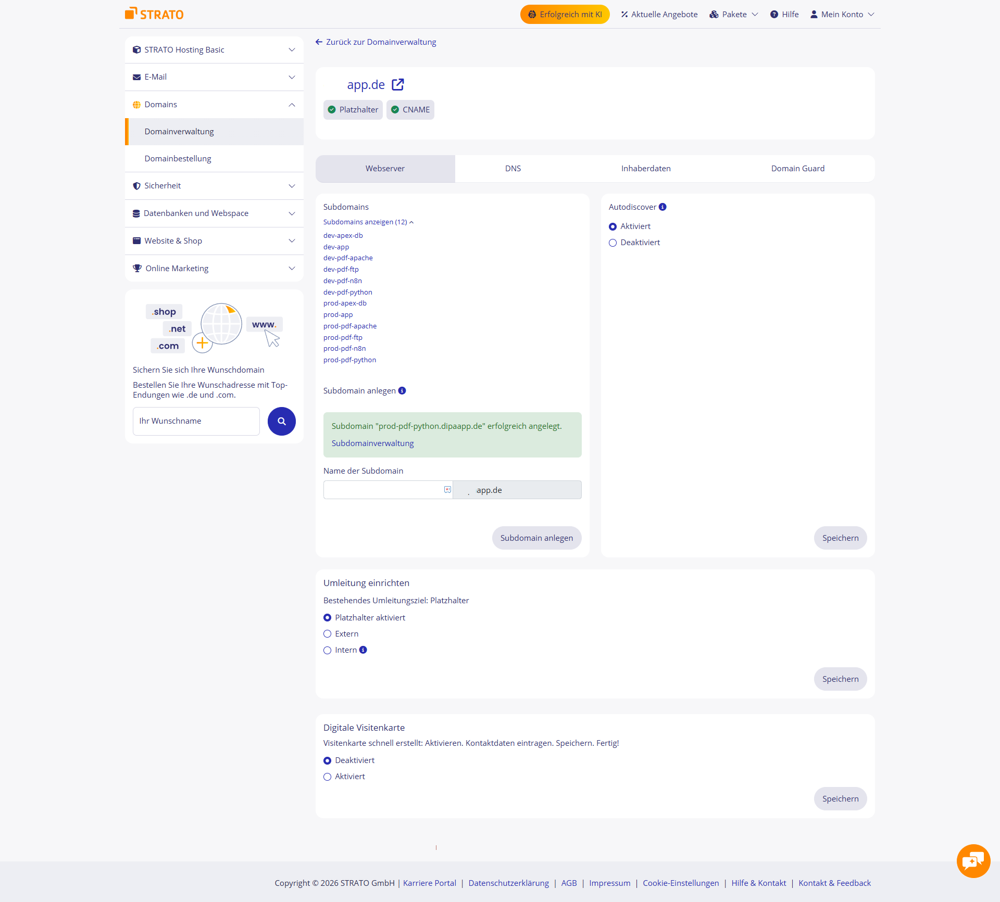

---

## Part 2 — Tailscale Installation

### What are Tailscale Services?

A Tailscale Service is a named virtual endpoint in your tailnet. Instead of connecting to a machine's Tailscale IP (which is tied to a specific device), a service gets its own VIP and a stable domain like `dipa-prod-apex-nginx.tail87235d.ts.net`. Any machine in the tailnet that advertises this service becomes a host for it. Admin tools become reachable by name — without any public DNS record or open firewall port.

### Step 2 — Generate the Install Script

Open the Tailscale admin panel at `https://login.tailscale.com/admin/machines` and click **Add device → Linux server**. Configure the options and click **Generate install script** to get the one-line install-and-authenticate command.

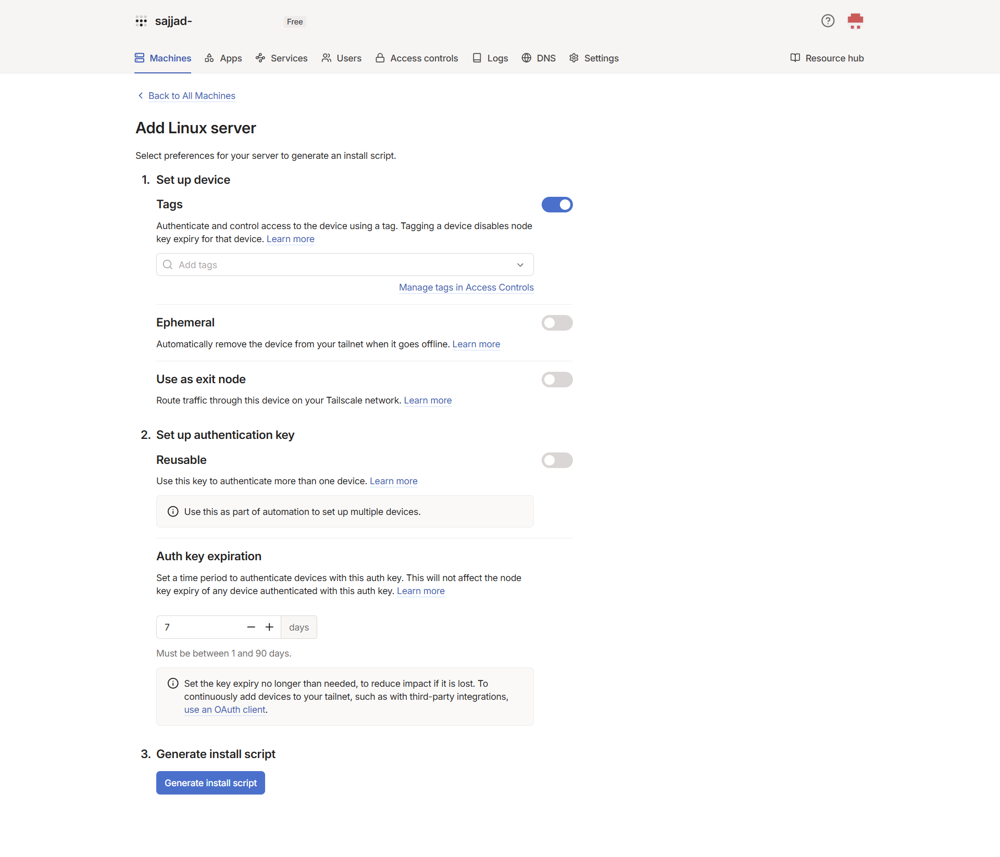

---

### Step 3 — Install and Authenticate on the Server

Run the generated command on the APEX server. It installs Tailscale and authenticates the machine in a single step using a one-time auth key:

```bash
curl -fsSL https://tailscale.com/install.sh | sh && sudo tailscale up --auth-key=<YOUR-AUTH-KEY>
```

The `--auth-key` flag bypasses the interactive browser login — the machine joins the tailnet automatically without any manual approval step.

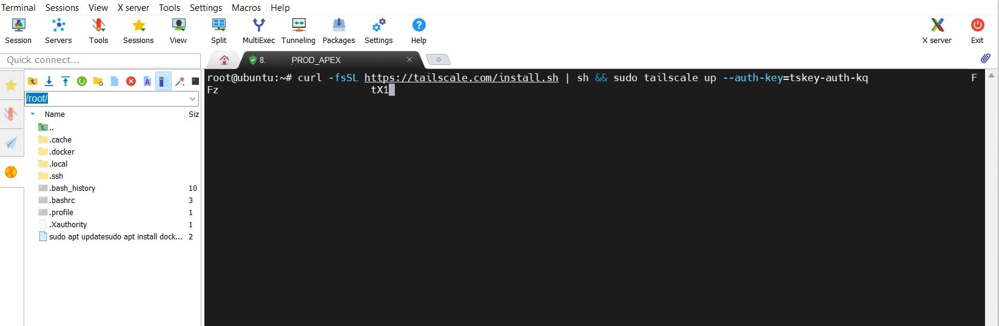

---

### Step 4 — Installation Complete

The script installs `tailscale` (37.1 MB) and the `tailscale-archive-keyring` package, creates the `tailscaled` systemd service, and starts it automatically. The output ends with:

```
Installation complete! Log in to start using Tailscale by running:
tailscale up
```

Because the `--auth-key` was already included in Step 3, the machine is already authenticated and joined to the tailnet — no further action needed.

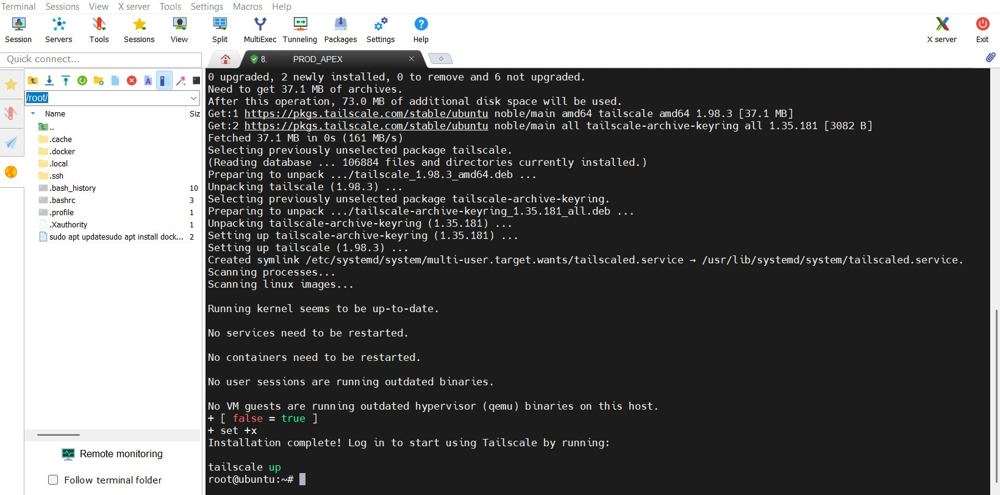

---

### Step 5 — Verify in the Tailscale Machines List

Open the Tailscale admin panel → **Machines**. The APEX server appears as `dipa-prod-apex` with Tailscale IP `100.93.172.16` and status **Connected**. This is the stable private IP the server will keep permanently in the tailnet.

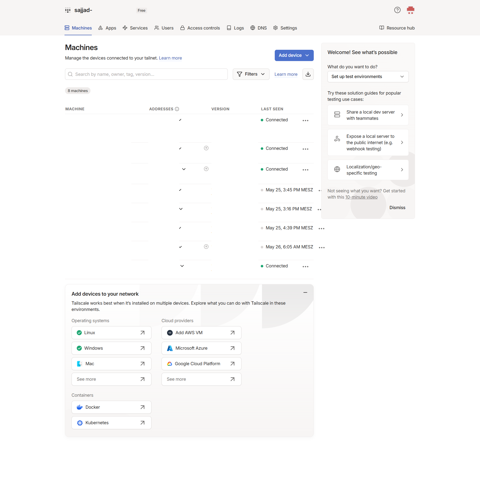

---

## Part 3 — Tailscale Service: Nginx Proxy Manager

### Step 6 — Existing Services Overview

The Tailscale **Services** tab shows all named services across the entire tailnet. The development servers already have four services configured — `dipa-dev-apex-nginx`, `dipa-dev-apex-portainer`, `dipa-dev-pdf-nginx`, and `dipa-dev-pdf-portainer` — all online. We now create the equivalent prod services for the APEX server.

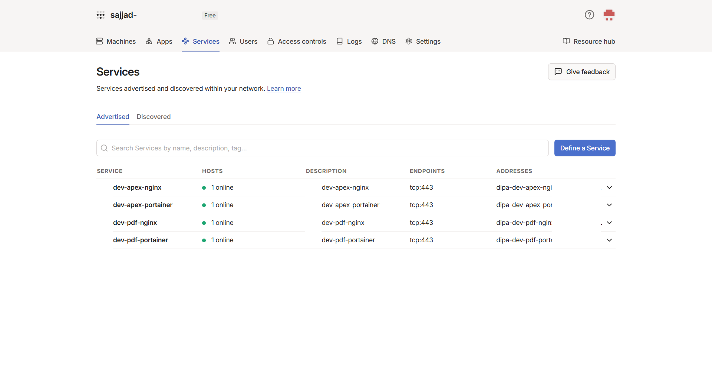

---

### Step 7 — Define the Nginx Service

Navigate to **Services → Define a Service** and fill in:

- **Service name** — `dipa-prod-apex-nginx`
- **Description** — `dipa-prod-apex-nginx`
- **Ports** — `tcp: 443`

The naming convention is `dipa-<environment>-<server>-<service>`. The full Tailscale domain: `dipa-prod-apex-nginx.tail87235d.ts.net`. Click **Define Service**.

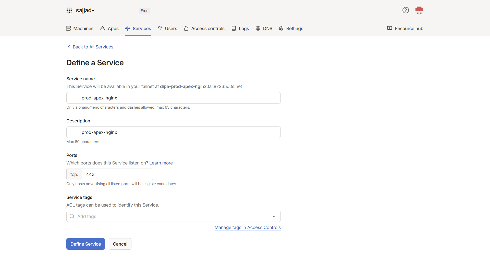

---

### Step 8 — Nginx Service Created

The service detail page confirms the Nginx service is created with its own virtual IP:

- **Tailscale IPv4** — `100.118.101.197`
- **Full domain** — `dipa-prod-apex-nginx.tail87235d.ts.net`
- **Endpoints** — `tcp:443`

The page shows "Next steps: Advertise & serve from host" — the service exists in the tailnet but has no host machine advertising it yet.

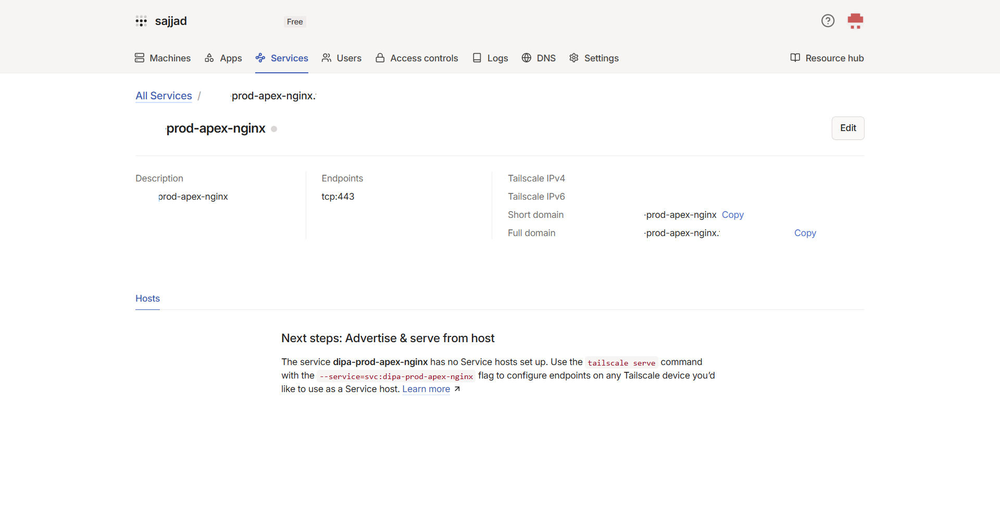

---

### Step 9 — Advertise the Service from the Server

Run on the APEX server to make it the host for the Nginx service:

```bash
tailscale serve --service=svc:dipa-prod-apex-nginx --bg http://localhost:443
```

- `--service=svc:dipa-prod-apex-nginx` — ties this configuration to the named service
- `--bg` — runs as a persistent background process that survives reboots
- `http://localhost:443` — forwards incoming VPN traffic to Nginx on port 443 locally

The output confirms:

```
https://dipa-prod-apex-nginx.tail87235d.ts.net/
|-- proxy http://localhost:443

Serve started and running in the background.
```

The service URL requires admin approval before it becomes accessible to tailnet members.

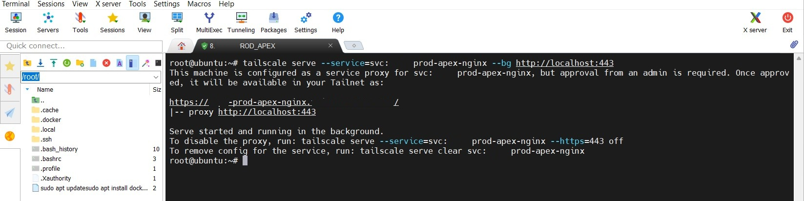

---

### Step 10 — Nginx Service Needs Approval

Back in the Tailscale admin panel, the `dipa-prod-apex-nginx` service now shows host machine `dipa-prod-apex` with status **Needs approval**. Click **Approve...** to open the confirmation dialog.


---

### Step 11 — Approve the Nginx Service Host

The approval dialog confirms:

- **Device** — `dipa-prod-apex`
- **Managed by** — `tag:sajjad-full-access`
- **Ports** — `tcp:443`

Click **Approve**.


---

### Step 12 — Nginx Service Online

Status **Online** in green. The Nginx Proxy Manager admin panel is now reachable at:

```
https://dipa-prod-apex-nginx.tail87235d.ts.net
```

This URL only resolves and routes correctly from inside the Tailscale VPN.

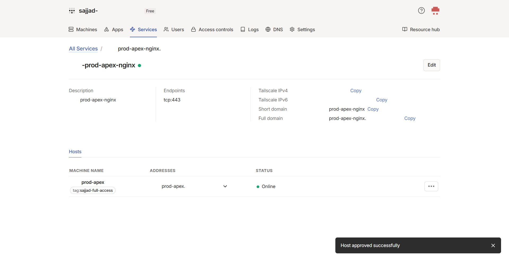

---

## Part 4 — Tailscale Service: Portainer

### Step 13 — Define the Portainer Service

Navigate to **Services → Define a Service** and fill in:

- **Service name** — `dipa-prod-apex-portainer`
- **Description** — `dipa-prod-apex-portainer`
- **Ports** — `tcp: 443`

Full domain: `dipa-prod-apex-portainer.tail87235d.ts.net`. Click **Define Service**.

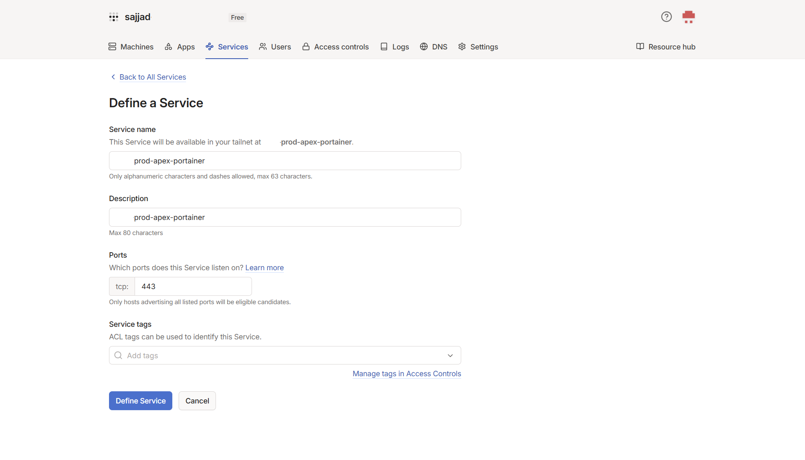

---

### Step 14 — Portainer Service Created

- **Tailscale IPv4** — `100.107.62.43`
- **Full domain** — `dipa-prod-apex-portainer.tail87235d.ts.net`
- **Endpoints** — `tcp:443`

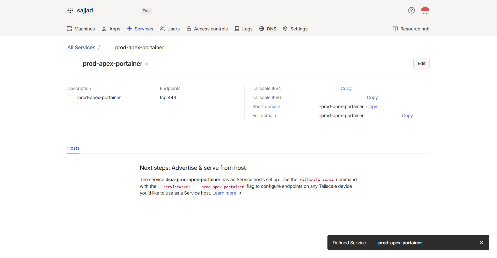

---

### Step 15 — Advertise Portainer from the Server

```bash
tailscale serve --service=svc:dipa-prod-apex-portainer --bg http://localhost:443
```

Output confirms:

```
https://dipa-prod-apex-portainer.tail87235d.ts.net/
|-- proxy http://localhost:443

Serve started and running in the background.
```

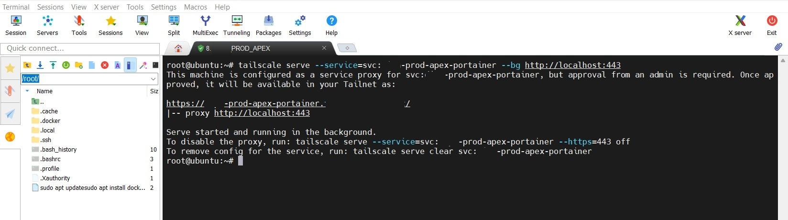

---

### Step 16 — Portainer Service Needs Approval

Status **Needs approval**. Click **Approve...**.

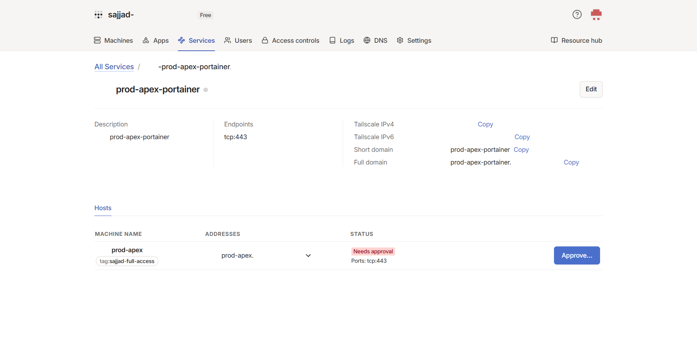

---

### Step 17 — Approve the Portainer Service Host

- **Device** — `dipa-prod-apex`
- **Managed by** — `tag:sajjad-full-access`
- **Ports** — `tcp:443`

Click **Approve**.

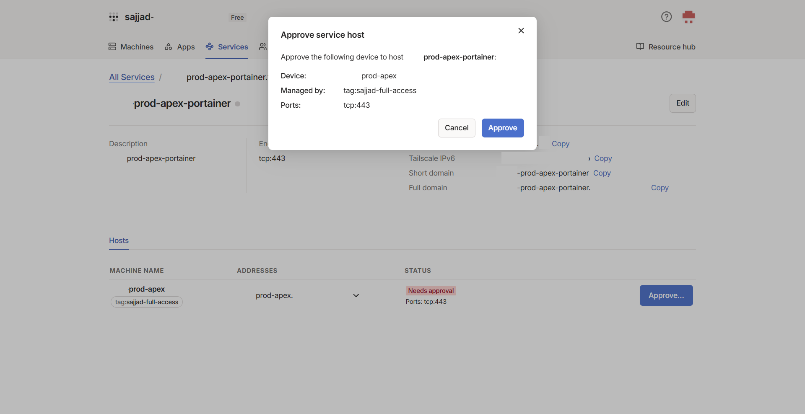

---

### Step 18 — Portainer Service Online

Status **Online** in green. Portainer is now accessible at:

```
https://dipa-prod-apex-portainer.tail87235d.ts.net
```

Both internal admin services are live and VPN-protected.

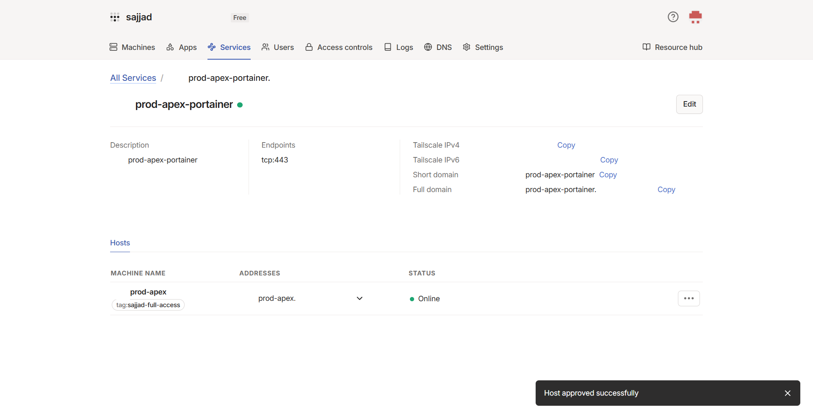

---

## Part 5 — Nginx Proxy Host Configuration

With both Tailscale services online, the next step is routing traffic through Nginx Proxy Manager. For NPM to proxy requests to Portainer by container name, both containers must share a Docker network. The `nginx_app` container currently only sits on the `nginx` network and cannot resolve the `portainer` hostname — this is fixed first, then the proxy hosts are configured.

### Step 19 — Open the Nginx Stack in Portainer

Open Portainer → **local → Stacks** → click the **nginx** stack. This shows the current compose configuration for `nginx_app` and `nginx_db`.

The Portainer network overview confirms the current state: the `ords-database` network is already connected to `nginx_app`, which allows NPM to proxy to ORDS. We now also need to connect the `portainer` network.

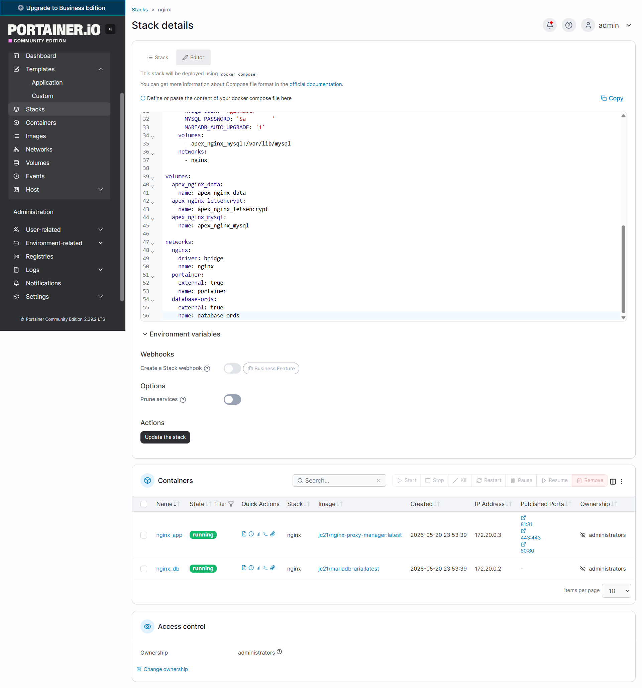

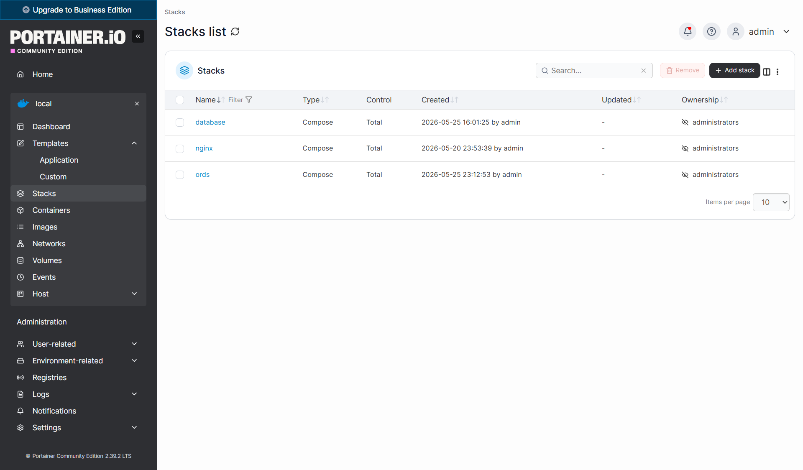

---

### Step 20 — Add the Portainer Network to the Nginx Compose

In the stack **Web editor**, extend the compose in two places:

1. Under the `nginx_app` service, add `portainer` to its `networks` list.
2. In the top-level `networks` section, declare `portainer` as an external network.

```yaml
services:
  nginx_app:
    # ... existing config ...
    networks:
      - nginx
      - portainer    # ← add this

networks:
  nginx:
    driver: bridge
    name: nginx
  portainer:         # ← add this block
    external: true
    name: portainer
```

Click **Update the stack**. Portainer recreates `nginx_app` with the updated network configuration. The container is now on both `nginx` and `portainer` networks.

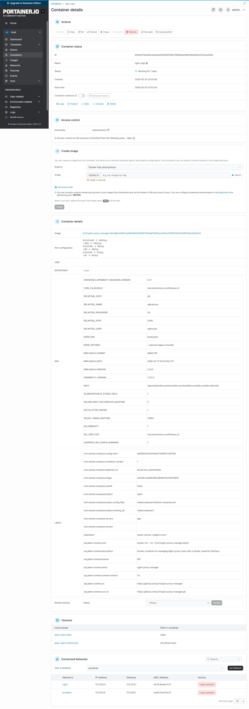

After the stack update, the network join can also be verified manually in Portainer under the container's network settings.

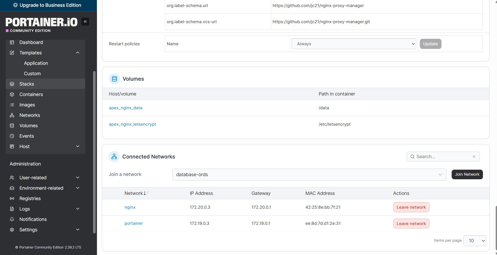

---

### Step 21 — Verify Portainer via Tailscale

From a device connected to the Tailscale VPN, open:

```
https://dipa-prod-apex-portainer.tail87235d.ts.net
```

The Portainer login page loads — confirming the full chain is working: Tailscale service → `tailscale serve` → `localhost:443` → `nginx_app` → `portainer:9000`.

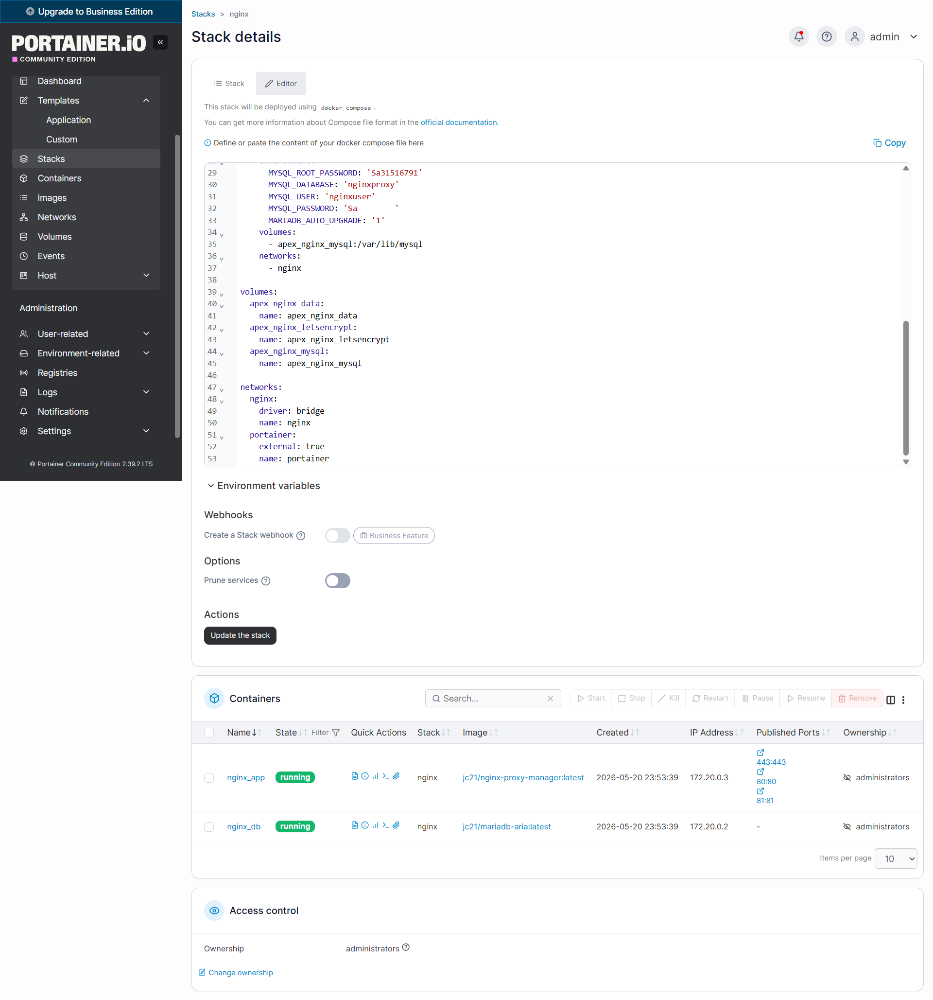

---

### Step 22 — Log into NPM and Create the Portainer Proxy Host

Open Nginx Proxy Manager via its Tailscale domain:

```
https://dipa-prod-apex-nginx.tail87235d.ts.net
```

Navigate to **Hosts → Proxy Hosts → Add Proxy Host**. Configure:

- **Domain Names** — `dipa-prod-apex-portainer.tail87235d.ts.net`
- **Scheme** — `http`
- **Forward Hostname / IP** — `portainer`
- **Forward Port** — `9000`
- Enable **Websockets Support**

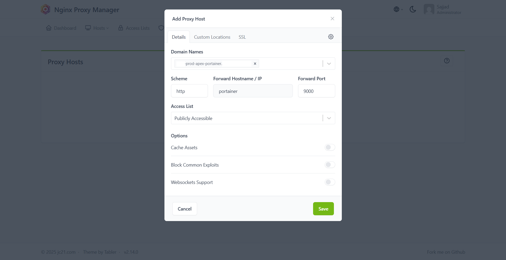

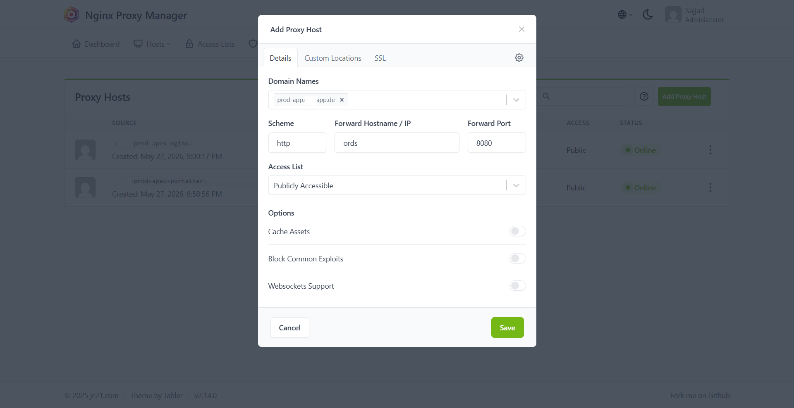

Under the **SSL** tab, request a Let's Encrypt certificate or configure a custom certificate for this domain.

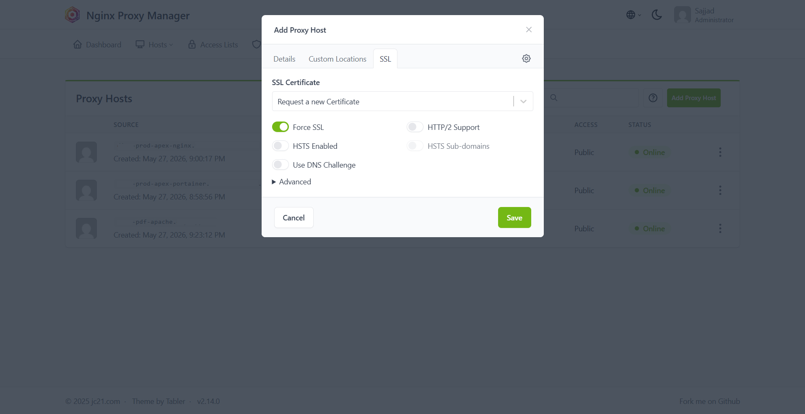

---

### Step 23 — Create the Nginx Admin Proxy Host

Add a second proxy host for the NPM admin interface itself:

- **Domain Names** — `dipa-prod-apex-nginx.tail87235d.ts.net`
- **Scheme** — `http`
- **Forward Hostname / IP** — `nginx_app`
- **Forward Port** — `81`
- Enable **Websockets Support**

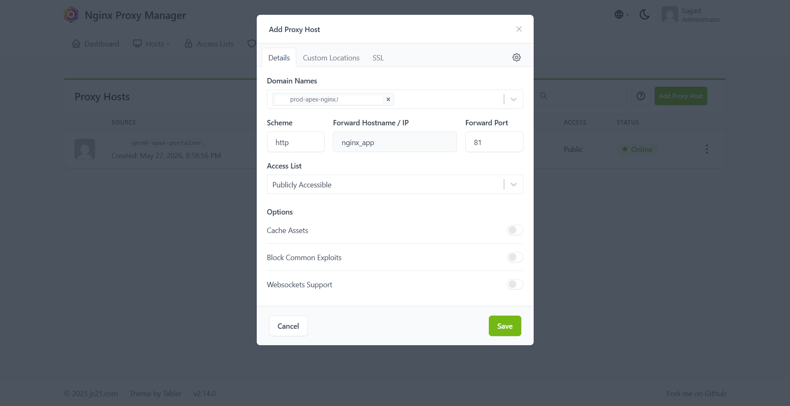

---

### Step 24 — All Proxy Hosts Active

The Proxy Hosts list now shows exactly three active hosts, all with status **Online**:

| Source | Destination | SSL |
|--------|-------------|-----|
| `dipa-prod-apex-nginx.tail87235d.ts.net` | `http://nginx_app:81` | HTTP Only |
| `dipa-prod-apex-portainer.tail87235d.ts.net` | `http://portainer:9000` | HTTP Only |
| `prod-app.dipaapp.de` | `http://ords:8080` | Let's Encrypt ✅ |

The two Tailscale proxy hosts use HTTP internally — the Tailscale tunnel itself is encrypted, so traffic between tailnet devices is never exposed unencrypted on the internet.

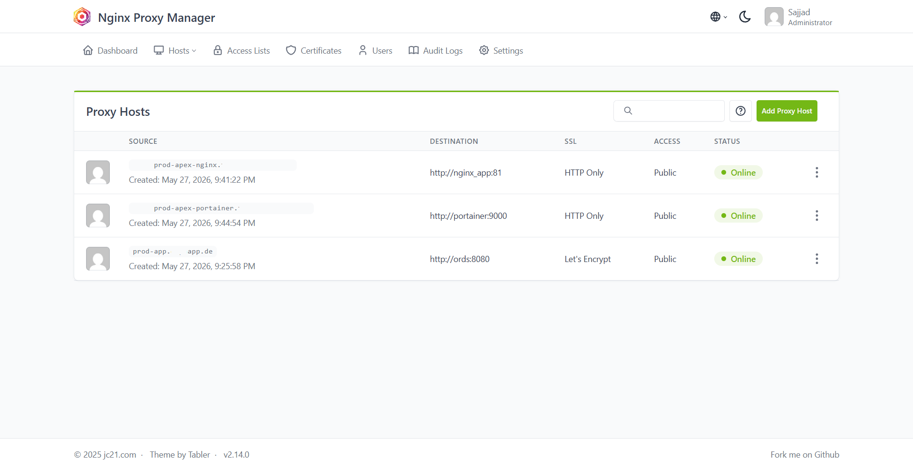

---

## Part 6 — Port Hardening with iptables

With Tailscale in place, the admin services are only reachable through the VPN tunnel. But Docker containers still publish their ports on the host's network interface — `0.0.0.0:9000`, `0.0.0.0:8181`, `0.0.0.0:81`, and so on. Any port scanner hitting the server's public IP can see these ports.

Docker manages its own iptables rules in a chain called `DOCKER-USER`. Rules inserted here are evaluated before Docker's own forwarding rules and survive Docker restarts and container rebuilds.

The strategy: for each admin port, insert two consecutive rules — one that allows connections from the Tailscale IP range (`100.64.0.0/10`), and one that drops everything else. Ports `80` and `443` are left untouched for public HTTPS traffic. Port `22` sits in the `INPUT` chain, not `DOCKER-USER`, so it is unaffected.

---

### Step 25 — Identify the Container Ports to Restrict

| Container | Port | Purpose | Action |
|-----------|------|---------|--------|
| `nginx_app` | `80`, `443` | Public HTTPS + HTTP | Keep open |
| `nginx_app` | `81` | Nginx Proxy Manager admin UI | Restrict to Tailscale |
| `nginx_db` | — | MariaDB (no host port) | No action needed |
| `ords` | `8181` | Oracle REST Data Services / APEX | Restrict to Tailscale |
| `database` | `1521` | Oracle Database listener | Restrict to Tailscale |
| `portainer` | `9000` | Portainer UI | Restrict to Tailscale |

Port `8000` is added as a precautionary measure for future containers.

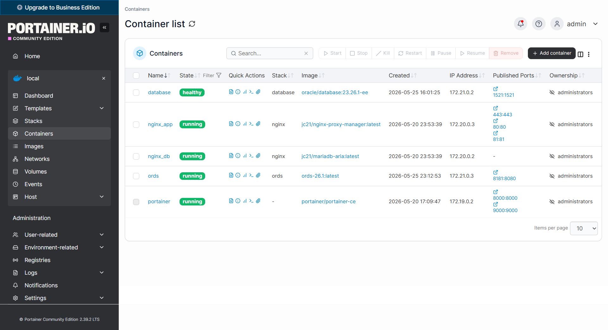

---

### Step 26 — Install iptables-persistent

```bash
apt install iptables-persistent -y
```

The package shows two dialogs during installation — one for IPv4 rules, one for IPv6. Either answer is fine at this point; the rules will be saved manually after they are applied.

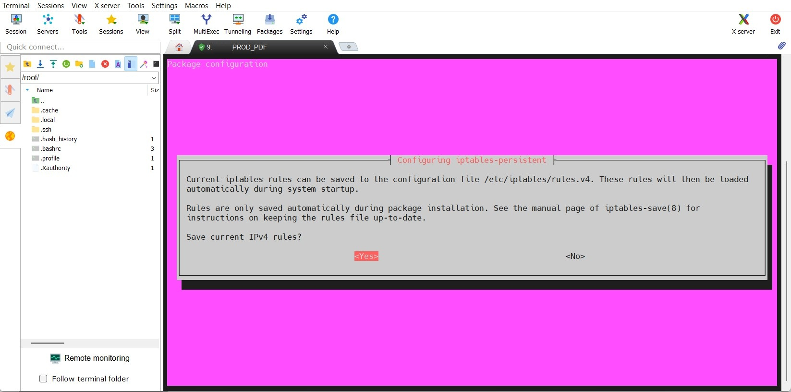

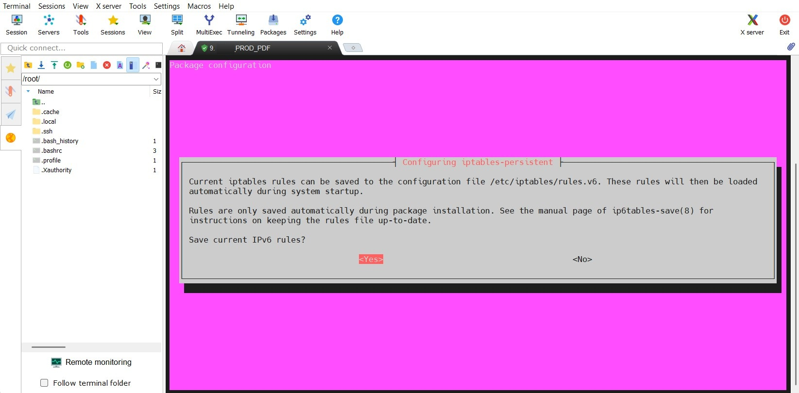

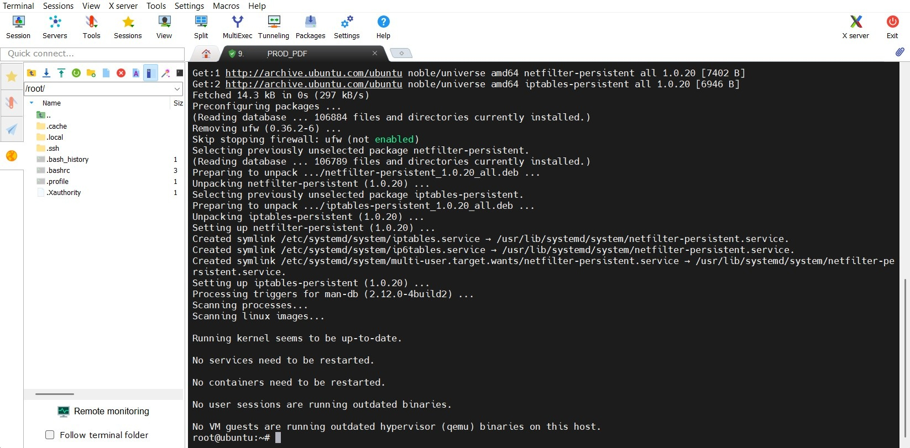

---

### Step 27 — Apply the Port Restriction Rules

```bash
# Start clean — remove any existing DOCKER-USER rules
iptables -F DOCKER-USER

# Tailscale IP range
TAILSCALE="100.64.0.0/10"

# Port 81 — Nginx Proxy Manager admin UI
iptables -I DOCKER-USER 1  -s $TAILSCALE -p tcp --dport 81   -j ACCEPT
iptables -I DOCKER-USER 2  -p tcp --dport 81   -j DROP

# Port 1521 — Oracle Database listener
iptables -I DOCKER-USER 3  -s $TAILSCALE -p tcp --dport 1521 -j ACCEPT
iptables -I DOCKER-USER 4  -p tcp --dport 1521 -j DROP

# Port 8181 — ORDS / Oracle APEX
iptables -I DOCKER-USER 5  -s $TAILSCALE -p tcp --dport 8181 -j ACCEPT
iptables -I DOCKER-USER 6  -p tcp --dport 8181 -j DROP

# Port 9000 — Portainer UI
iptables -I DOCKER-USER 7  -s $TAILSCALE -p tcp --dport 9000 -j ACCEPT
iptables -I DOCKER-USER 8  -p tcp --dport 9000 -j DROP

# Port 8000 — reserved / future use
iptables -I DOCKER-USER 9  -s $TAILSCALE -p tcp --dport 8000 -j ACCEPT
iptables -I DOCKER-USER 10 -p tcp --dport 8000 -j DROP

# Save rules — survives reboots
iptables-save > /etc/iptables/rules.v4
```

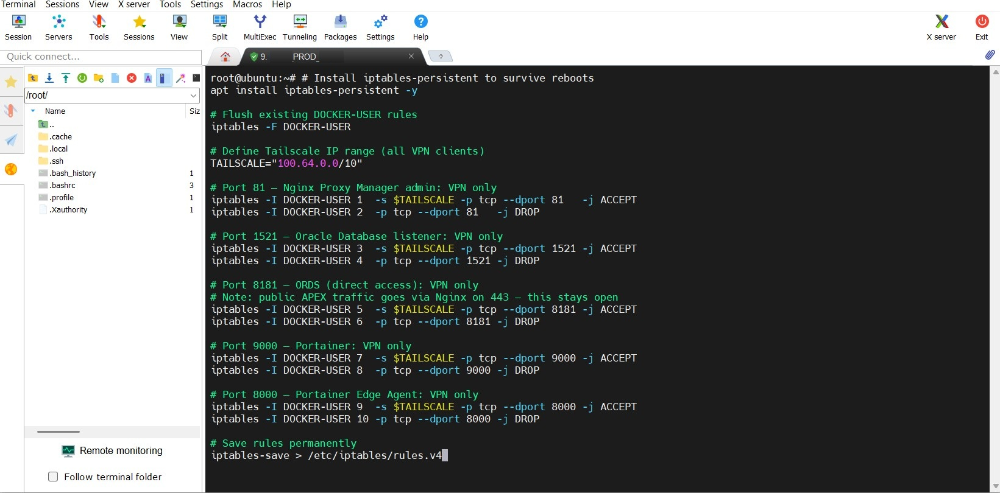

---

### Step 28 — Verify the Rules

```bash
iptables -L DOCKER-USER -n --line-numbers
```

The output shows all 10 rules in order — 5 paired ACCEPT/DROP blocks. The `100.64.0.0/10` source range appears in every ACCEPT rule.

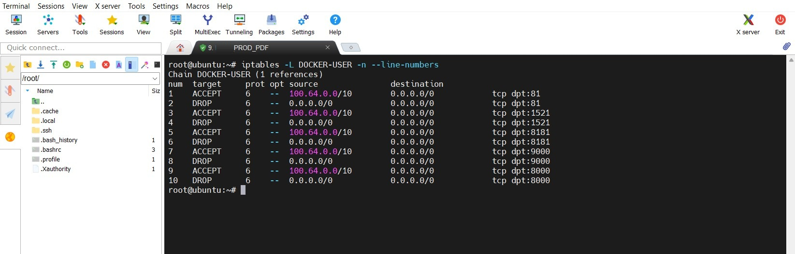

---

### Step 29 — Confirm Ports Are Blocked

From a device **not** connected to Tailscale, open a browser and navigate to:

```
http://<YOUR-SERVER-IP>:9000
```

The browser returns `ERR_CONNECTION_TIMED_OUT` — the packet is silently dropped with no response. The same applies to ports `81`, `1521`, `8181`, and `8000` from the public internet. From inside the Tailscale VPN all ports remain fully accessible.

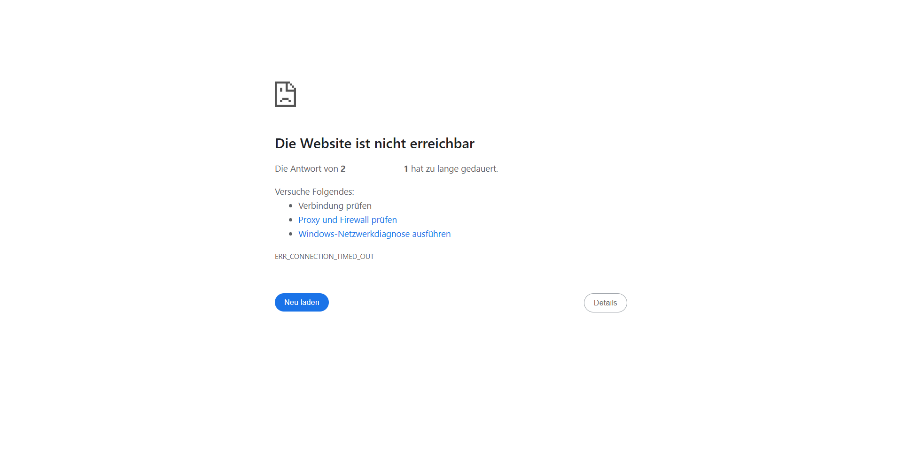

---

## Part 7 — Reboot Verification

### Step 30 — Reboot and Verify All Services

After completing the setup, perform a full server reboot to confirm that all components start automatically without manual intervention. A correct setup requires:

- Docker daemon starts automatically (`systemctl enable docker` is set by default on Ubuntu)
- All containers with `restart: always` restart themselves
- `tailscaled` systemd service starts and reconnects to the tailnet
- `iptables-persistent` restores all rules from `/etc/iptables/rules.v4`
- `tailscale serve` background processes reconnect (they are managed by `tailscaled`)

```bash
reboot
```

After the reboot, wait 60–90 seconds and verify:

```bash
# All containers running?
docker ps

# Tailscale connected?
tailscale status

# iptables rules restored?
iptables -L DOCKER-USER -n --line-numbers
```

The screenshot confirms the result: all five containers running, Tailscale reconnected, iptables rules active. Access via Tailscale IP, via Tailscale domain name, and via NPM proxy hosts all work correctly. Access via the server's public IP to any admin port times out as expected.

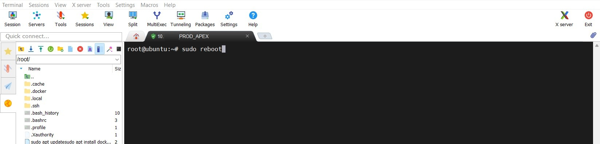

---

## Quick Reference

### iptables

```bash
# View all DOCKER-USER rules with line numbers
iptables -L DOCKER-USER -n --line-numbers

# Remove all custom DOCKER-USER rules (reset to default)
iptables -F DOCKER-USER

# After any change — save rules to persist across reboots
iptables-save > /etc/iptables/rules.v4
```

### Tailscale

```bash
# Check connection status and Tailscale IP
tailscale status

# Stop Tailscale (e.g. for troubleshooting)
systemctl stop tailscaled

# Start Tailscale
systemctl start tailscaled

# Check which serve configurations are active
tailscale serve status
```

---

## Result

| Service | URL | Access |
|---------|-----|--------|
| Oracle APEX | `https://prod-app.dipaapp.de/ords/apex` | Public |
| Oracle DB (SQL Developer) | `prod-apex-db.dipaapp.de:1521` | VPN only |
| Nginx Admin | `https://dipa-prod-apex-nginx.tail87235d.ts.net` | VPN only |
| Portainer | `https://dipa-prod-apex-portainer.tail87235d.ts.net` | VPN only |

**Port hardening summary:**

| Port | Service | Rule |
|------|---------|------|
| `80` | Nginx HTTP | Open (public) |
| `443` | Nginx HTTPS | Open (public) |
| `81` | Nginx Proxy Manager admin | Tailscale only |
| `1521` | Oracle Database listener | Tailscale only |
| `8181` | ORDS / APEX direct | Tailscale only |
| `9000` | Portainer | Tailscale only |
| `8000` | Reserved | Tailscale only |

Rules are stored in `/etc/iptables/rules.v4` and restored automatically on reboot by `iptables-persistent`. The `tailscale serve` background processes are managed by `tailscaled` and reconnect automatically after reboot.

The next chapter is **02_pdf-server** — setting up the second server with Portainer, Nginx, Apache, Python, n8n, FTP, and Tailscale.
