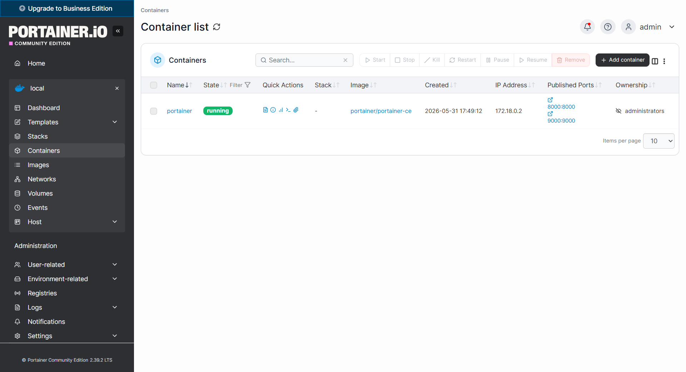

# Portainer — PDF Server

## What This Chapter Covers

Portainer is installed on the PDF server using the exact same procedure as on the APEX server. This chapter does not repeat every step in detail — refer to the full installation guide here:

📖 **[→ Portainer Installation Guide (Database Server)](../../01_database-server/01_portainer/portainer.md)**

The steps are identical:

1. Connect via SSH (MobaXterm)
2. Install Docker & enable on boot
3. Create the `portainer` Docker network and `portainer_data` volume
4. Run the Portainer container with `--restart=always`

---

## Requirements

| Item | Details |
|------|---------|
| OS | Ubuntu 24.04 LTS |
| User | `root` |
| Open Ports | `9000` (Web UI), `8000` (Agent) |
| Depends on | Docker |

---

## Result — Portainer Running

The screenshot below confirms that Portainer is successfully installed and running on the PDF server. The Portainer web interface is accessible on port `9000` and all subsequent components (Nginx, Apache, Python, n8n, FTP) will be deployed and managed through it.

---

The next chapter covers **Nginx Proxy Manager** — reverse proxy and SSL termination for all public-facing services on this server.

---

[↑ Back to Overview](../../../README.md) | [→ 02 Nginx Proxy Manager](../02_nginx/nginx.md)
